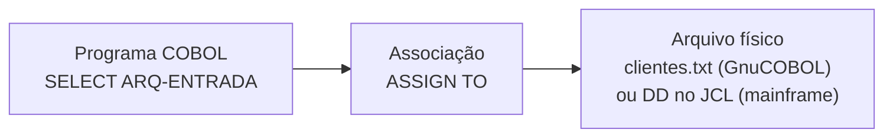

<h1 class="page-title">
  <svg class="title-icon" viewBox="0 0 24 24" fill="none" stroke="currentColor" stroke-width="1.8" stroke-linecap="round" stroke-linejoin="round" aria-hidden="true">
    <path d="M14 3H7a2 2 0 0 0-2 2v14a2 2 0 0 0 2 2h10a2 2 0 0 0 2-2V8z"/>
    <path d="M14 3v5h5"/>
    <path d="M9 13h6M9 17h6"/>
  </svg>
  Arquivos
</h1>

> Arquivos sequenciais, indexados e relativos, operações de leitura e escrita, `FILE STATUS` e a relação com o VSAM.

---

## Objetivos

Ao final desta seção, você deverá ser capaz de:

- Declarar arquivos com `SELECT`, `ASSIGN` e `FD`.
- Escolher a organização adequada: sequencial, indexada ou relativa.
- Ler, gravar, atualizar e excluir registros.
- Usar `FILE STATUS` para tratar erros de entrada e saída.
- Relacionar os tipos de arquivo COBOL com os tipos de dataset VSAM.
- Ordenar arquivos com `SORT`.

---

## Visão geral

Um programa COBOL não acessa um arquivo físico diretamente. Ele trabalha com um **arquivo lógico**, que é associado ao arquivo físico fora da lógica do programa. Isso permite trocar o arquivo real sem recompilar.



Dois lugares do programa descrevem um arquivo:

| Onde | Divisão e seção | Conteúdo |
|---|---|---|
| `SELECT` | `ENVIRONMENT DIVISION`, `INPUT-OUTPUT SECTION`, `FILE-CONTROL` | Nome lógico, associação, organização e modo de acesso |
| `FD` | `DATA DIVISION`, `FILE SECTION` | Layout do registro |

---

## Organizações de arquivo

| Organização | Acesso aos registros | Equivalente VSAM |
|---|---|---|
| `SEQUENTIAL` | Um após o outro, na ordem de gravação | ESDS |
| `LINE SEQUENTIAL` | Arquivo texto, uma linha por registro (GnuCOBOL e outros compiladores, não faz parte do mainframe tradicional) | (arquivo texto) |
| `INDEXED` | Por chave, e também em sequência | KSDS |
| `RELATIVE` | Pelo número relativo do registro | RRDS |

---

## Arquivo sequencial

### Declaração

```cobol
       ENVIRONMENT DIVISION.
       INPUT-OUTPUT SECTION.
       FILE-CONTROL.
           SELECT ARQ-CLIENTES ASSIGN TO "clientes.txt"
               ORGANIZATION IS LINE SEQUENTIAL
               FILE STATUS IS WS-FS.

       DATA DIVISION.
       FILE SECTION.
       FD ARQ-CLIENTES.
       01 REG-CLIENTE.
          05 REG-CODIGO     PIC 9(4).
          05 REG-NOME       PIC X(20).
          05 REG-SALDO      PIC 9(5)V99.

       WORKING-STORAGE SECTION.
       01 WS-FS             PIC XX VALUE SPACES.
       01 WS-FIM            PIC X  VALUE "N".
          88 FIM-ARQUIVO    VALUE "S".
```

No mainframe, a forma usual é `ASSIGN TO ENTRADA`, em que `ENTRADA` é o nome do `DD` no JCL. Veja [JCL]({{ 'programacao/cobol/jcl/index.html' | relative_url }}).

### Arquivo de dados de exemplo

Arquivo `clientes.txt`, em que cada linha tem 31 caracteres (4 do código, 20 do nome e 7 do saldo, com 2 casas decimais implícitas):

```text
0001MARIA SOUZA         0150000
0002JOAO PEREIRA        0032050
0003ANA LIMA            0000000
```

### Leitura completa

```cobol
       PROCEDURE DIVISION.
       PRINCIPAL.
           OPEN INPUT ARQ-CLIENTES.
           IF WS-FS NOT = "00"
               DISPLAY "ERRO AO ABRIR: " WS-FS
               STOP RUN
           END-IF.

           PERFORM UNTIL FIM-ARQUIVO
               READ ARQ-CLIENTES
                   AT END
                       SET FIM-ARQUIVO TO TRUE
                   NOT AT END
                       PERFORM PROCESSA-REGISTRO
               END-READ
           END-PERFORM.

           CLOSE ARQ-CLIENTES.
           STOP RUN.

       PROCESSA-REGISTRO.
           DISPLAY REG-CODIGO " - " REG-NOME.
```

### Gravação

```cobol
           SELECT ARQ-SAIDA ASSIGN TO "saida.txt"
               ORGANIZATION IS LINE SEQUENTIAL
               FILE STATUS IS WS-FS-SAIDA.

           OPEN OUTPUT ARQ-SAIDA.
           MOVE 1 TO REG-CODIGO.
           MOVE "CARLOS" TO REG-NOME.
           MOVE 100.50 TO REG-SALDO.
           WRITE REG-SAIDA.
           CLOSE ARQ-SAIDA.
```

`WRITE` usa o **nome do registro** (nível `01` do `FD`), e não o nome do arquivo. Já `READ` usa o nome do arquivo.

### Modos de abertura

| Modo | Efeito |
|---|---|
| `OPEN INPUT` | Somente leitura; o arquivo precisa existir |
| `OPEN OUTPUT` | Cria o arquivo e **apaga o conteúdo anterior** |
| `OPEN EXTEND` | Grava no final do arquivo, preservando o que já existe |
| `OPEN I-O` | Leitura e atualização (`REWRITE`, `DELETE`) |

> **Atenção:** `OPEN OUTPUT` sobre um arquivo existente destrói o conteúdo anterior sem aviso. Para acrescentar registros, use `OPEN EXTEND`.

### READ INTO e WRITE FROM

Para trabalhar com uma cópia do registro em área da `WORKING-STORAGE`:

```cobol
           READ ARQ-CLIENTES INTO WS-CLIENTE.
           WRITE REG-SAIDA FROM WS-CLIENTE.
```

---

## FILE STATUS

A cláusula `FILE STATUS IS campo` associa o arquivo a um campo de dois caracteres, atualizado após **cada** operação. É a forma recomendada de detectar erros, porque sem ela um erro de arquivo costuma encerrar o programa.

| Status | Significado |
|---|---|
| `00` | Operação concluída com sucesso |
| `02` | Sucesso, com chave alternada duplicada (arquivo indexado) |
| `10` | Fim de arquivo (*end of file*) |
| `21` | Erro de sequência de chave |
| `22` | Chave duplicada em `WRITE` ou `REWRITE` |
| `23` | Registro não encontrado |
| `30` | Erro permanente de entrada ou saída |
| `35` | `OPEN` de arquivo inexistente |
| `37` | Permissão negada ou modo de abertura incompatível |
| `39` | Atributos do arquivo conflitam com o `SELECT` ou `FD` |
| `41` | `OPEN` de um arquivo já aberto |
| `42` | `CLOSE` de um arquivo não aberto |
| `43` | `DELETE` ou `REWRITE` sem `READ` anterior (acesso sequencial) |
| `46` | `READ` após o fim do arquivo ou sem posicionamento válido |
| `47` | `READ` em arquivo não aberto para entrada |
| `48` | `WRITE` em arquivo não aberto para saída |
| `49` | `DELETE` ou `REWRITE` em arquivo não aberto em `I-O` |

> **Dica:** crie uma rotina de tratamento de erro genérica que exiba o nome do arquivo, a operação e o `FILE STATUS`. Isso reduz muito o tempo de diagnóstico.

---

## Arquivo indexado

Em um arquivo `INDEXED`, cada registro possui uma **chave primária**, única, que permite acesso direto.

```cobol
           SELECT ARQ-CLI ASSIGN TO "clientes.dat"
               ORGANIZATION IS INDEXED
               ACCESS MODE IS DYNAMIC
               RECORD KEY IS CLI-CODIGO
               ALTERNATE RECORD KEY IS CLI-NOME WITH DUPLICATES
               FILE STATUS IS WS-FS.

       FD ARQ-CLI.
       01 REG-CLI.
          05 CLI-CODIGO     PIC 9(4).
          05 CLI-NOME       PIC X(20).
          05 CLI-SALDO      PIC 9(5)V99.
```

### Modos de acesso

| `ACCESS MODE` | Uso |
|---|---|
| `SEQUENTIAL` | Leitura em ordem de chave |
| `RANDOM` | Acesso direto por chave |
| `DYNAMIC` | Combina os dois, permitindo alternar entre eles |

### Operações

```cobol
      * INCLUSAO
           MOVE 10 TO CLI-CODIGO.
           MOVE "PEDRO" TO CLI-NOME.
           MOVE 500 TO CLI-SALDO.
           WRITE REG-CLI
               INVALID KEY DISPLAY "CHAVE DUPLICADA"
           END-WRITE.

      * CONSULTA POR CHAVE
           MOVE 10 TO CLI-CODIGO.
           READ ARQ-CLI
               INVALID KEY DISPLAY "NAO ENCONTRADO"
               NOT INVALID KEY DISPLAY CLI-NOME
           END-READ.

      * ATUALIZACAO
           MOVE 750 TO CLI-SALDO.
           REWRITE REG-CLI
               INVALID KEY DISPLAY "ERRO NA ATUALIZACAO"
           END-REWRITE.

      * EXCLUSAO
           DELETE ARQ-CLI
               INVALID KEY DISPLAY "ERRO NA EXCLUSAO"
           END-DELETE.
```

| Comando | Função | Modo de abertura |
|---|---|---|
| `WRITE` | Inclui registro | `OUTPUT`, `I-O` ou `EXTEND` |
| `READ` | Lê registro | `INPUT` ou `I-O` |
| `REWRITE` | Atualiza o último registro lido | `I-O` |
| `DELETE` | Exclui o registro | `I-O` |
| `START` | Posiciona o arquivo em uma chave, sem ler | `INPUT` ou `I-O` |

### START e leitura sequencial por chave

```cobol
           MOVE 100 TO CLI-CODIGO.
           START ARQ-CLI KEY IS >= CLI-CODIGO
               INVALID KEY DISPLAY "NENHUM REGISTRO"
           END-START.

           PERFORM UNTIL FIM-ARQUIVO
               READ ARQ-CLI NEXT RECORD
                   AT END SET FIM-ARQUIVO TO TRUE
                   NOT AT END DISPLAY CLI-CODIGO " " CLI-NOME
               END-READ
           END-PERFORM.
```

`START` posiciona o arquivo no primeiro registro cuja chave satisfaz a condição; os `READ NEXT` seguintes percorrem os registros em ordem de chave.

---

## Arquivo relativo

Em um arquivo `RELATIVE`, cada registro é localizado pelo seu **número de posição** (1, 2, 3...):

```cobol
           SELECT ARQ-REL ASSIGN TO "rel.dat"
               ORGANIZATION IS RELATIVE
               ACCESS MODE IS RANDOM
               RELATIVE KEY IS WS-POSICAO
               FILE STATUS IS WS-FS.

           MOVE 5 TO WS-POSICAO.
           READ ARQ-REL
               INVALID KEY DISPLAY "VAZIO"
           END-READ.
```

`WS-POSICAO` é um campo numérico declarado na `WORKING-STORAGE SECTION`, fora do registro.

---

## VSAM e COBOL

No mainframe, os arquivos indexados e relativos são em geral **datasets VSAM** (*Virtual Storage Access Method*). O COBOL os acessa pela mesma sintaxe vista acima, e a criação do dataset é feita fora do programa, com o utilitário `IDCAMS`.

| Tipo VSAM | Nome completo | Acesso | Organização COBOL |
|---|---|---|---|
| **KSDS** | *Key-Sequenced Data Set* | Por chave | `INDEXED` |
| **ESDS** | *Entry-Sequenced Data Set* | Ordem de gravação | `SEQUENTIAL` |
| **RRDS** | *Relative Record Data Set* | Número relativo | `RELATIVE` |

O KSDS é o mais usado. Em mainframe, o `FILE STATUS` pode ser estendido com o código de retorno específico do VSAM, mas os códigos de dois caracteres vistos acima continuam valendo.

Veja a criação de um KSDS com `IDCAMS` em [JCL]({{ 'programacao/cobol/jcl/index.html' | relative_url }}).

---

## Associação com o arquivo físico

| Ambiente | Como o `ASSIGN` é resolvido |
|---|---|
| **GnuCOBOL** | O nome entre aspas é o caminho do arquivo. Com nome sem aspas, o compilador procura uma variável de ambiente `DD_nome`, `dd_nome` ou `nome`, e usa `COB_FILE_PATH` como prefixo de pasta |
| **Mainframe** | O nome indica um `DD` do JCL, que aponta para o dataset |

Exemplo no GnuCOBOL, com nome lógico:

```cobol
           SELECT ARQ-ENTRADA ASSIGN TO ENTRADA.
```

```bash
export DD_ENTRADA=clientes.txt
./programa
```

Essa técnica aproxima o comportamento do GnuCOBOL ao do JCL, o que facilita transportar programas entre os dois ambientes.

---

## Ordenação com SORT

O comando `SORT` ordena um arquivo por uma ou mais chaves. Ele usa um arquivo de trabalho, declarado com `SD` (*sort description*) em vez de `FD`.

```cobol
           SELECT ARQ-ENT  ASSIGN TO "entrada.txt"
               ORGANIZATION IS LINE SEQUENTIAL.
           SELECT ARQ-SAI  ASSIGN TO "saida.txt"
               ORGANIZATION IS LINE SEQUENTIAL.
           SELECT ARQ-SORT ASSIGN TO "sortwork".

       FD ARQ-ENT.
       01 REG-ENT.
          05 ENT-CODIGO   PIC 9(4).
          05 ENT-NOME     PIC X(20).
       FD ARQ-SAI.
       01 REG-SAI         PIC X(24).
       SD ARQ-SORT.
       01 REG-SORT.
          05 SD-CODIGO    PIC 9(4).
          05 SD-NOME      PIC X(20).

           SORT ARQ-SORT
               ON ASCENDING KEY SD-NOME
               USING ARQ-ENT
               GIVING ARQ-SAI.
```

`USING` e `GIVING` abrem, leem, gravam e fecham os arquivos automaticamente. Para filtrar ou transformar registros durante a ordenação, existem as variações `INPUT PROCEDURE` e `OUTPUT PROCEDURE`, que usam `RELEASE` e `RETURN`.

---

## Boas práticas

- Sempre declare `FILE STATUS` e teste o resultado de `OPEN`, `READ`, `WRITE` e `CLOSE`.
- Feche todos os arquivos antes de `STOP RUN`.
- Use nomes de condição (nível `88`) para fim de arquivo.
- Mantenha o layout do registro em um **copybook** compartilhado entre os programas que usam o arquivo.
- Valide dados lidos antes de usá-los em cálculos.
- Prefira `OPEN EXTEND` a `OPEN OUTPUT` quando for acrescentar registros.

---

## Erros comuns

- Fazer `READ` sem `OPEN`, ou depois de `CLOSE`.
- Usar o nome do arquivo no `WRITE` em vez do nome do registro.
- Esquecer o teste de `FILE STATUS` e continuar após um erro de abertura.
- Dimensionar o `FD` diferente do tamanho real das linhas do arquivo.
- Processar o último registro duas vezes, por testar o fim de arquivo no lugar errado. Use `AT END` / `NOT AT END`.
- Fazer `REWRITE` sem ter lido o registro antes.
- Usar `OPEN OUTPUT` e perder dados existentes.

---

## Resumo

- `SELECT` associa o arquivo lógico ao físico; `FD` descreve o registro.
- As organizações são sequencial, indexada e relativa, que correspondem a ESDS, KSDS e RRDS no VSAM.
- `OPEN`, `READ`, `WRITE`, `REWRITE`, `DELETE`, `START` e `CLOSE` formam o conjunto básico de operações.
- `FILE STATUS` informa o resultado de cada operação e deve ser sempre testado.
- `SORT` ordena arquivos, com `USING`/`GIVING` ou com procedimentos de entrada e saída.

---

## Próximos passos

<div class="wiki-topic-list">

  <a class="wiki-topic" href="{{ 'programacao/cobol/modularizacao/index.html' | relative_url }}">
    <span class="wiki-topic-title">Próximo: Modularização</span>
    <span class="wiki-topic-description">Sections, subprogramas, CALL, parâmetros e copybooks.</span>
  </a>

  <a class="wiki-topic" href="{{ 'programacao/cobol/exercicios/index.html' | relative_url }}">
    <span class="wiki-topic-title">Exercícios</span>
    <span class="wiki-topic-description">Pratique leitura, gravação e atualização de arquivos.</span>
  </a>

  <a class="wiki-topic" href="{{ 'programacao/cobol/estruturas-dados/index.html' | relative_url }}">
    <span class="wiki-topic-title">Voltar para Estruturas de Dados</span>
    <span class="wiki-topic-description">Revise PIC, OCCURS e REDEFINES.</span>
  </a>

</div>