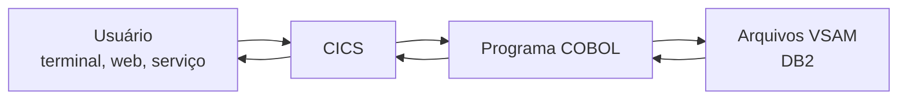
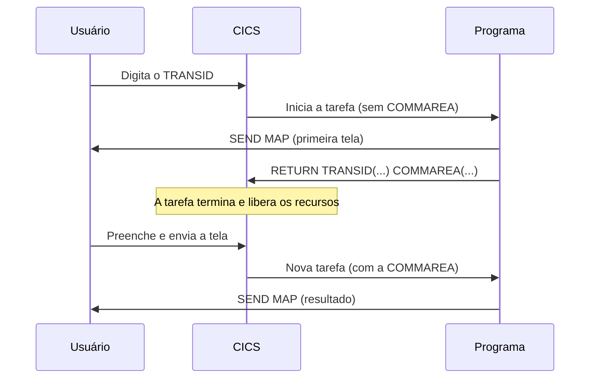

<h1 class="page-title">
  <svg class="title-icon" viewBox="0 0 24 24" fill="none" stroke="currentColor" stroke-width="1.8" stroke-linecap="round" stroke-linejoin="round" aria-hidden="true">
    <path d="M7 16l-4-4 4-4"/>
    <path d="M17 8l4 4-4 4"/>
    <path d="M14 4l-4 16"/>
  </svg>
  CICS
</h1>

> Processamento transacional, programas COBOL, transações, COMMAREA, comandos EXEC CICS, mapas BMS e acesso a dados.

---

## Objetivos

Ao final desta seção, você deverá ser capaz de:

- Explicar o que é o CICS e qual problema ele resolve.
- Diferenciar transação, programa e tarefa.
- Escrever comandos `EXEC CICS` em um programa COBOL.
- Entender o modelo **pseudoconversacional** e o uso da COMMAREA.
- Reconhecer o papel dos mapas BMS e os principais comandos de arquivo.

---

## O que é o CICS

**CICS** (*Customer Information Control System*) é o monitor de processamento de transações da IBM. Ele recebe as requisições dos usuários (de terminais, aplicações web ou outros sistemas), executa o programa correspondente e devolve a resposta em curto tempo, atendendo milhares de usuários ao mesmo tempo.



O CICS cuida de funções que o programa não precisa reimplementar: controle de usuários simultâneos, gerenciamento de memória, comunicação com terminais, segurança e integridade das transações.

---

## Conceitos principais

| Conceito | Descrição |
|---|---|
| **Transação** | Unidade de trabalho identificada por um código de até 4 caracteres (**TRANSID**), como `CONS` |
| **Programa** | Código executável, associado a uma transação |
| **Tarefa** (*task*) | Uma execução de uma transação para um usuário específico |
| **Terminal** | Dispositivo ou sessão em que o usuário interage |
| **Mapa (BMS)** | Definição da tela apresentada ao usuário |
| **COMMAREA** | Área de comunicação para passar dados entre execuções |

O usuário digita o **TRANSID** no terminal, o CICS localiza o programa associado e cria uma tarefa para executá-lo.

---

## Definições de recursos

Para um programa rodar sob o CICS, ele precisa ser definido ao sistema. As definições principais são:

| Recurso | Função |
|---|---|
| **PROGRAM** | Registra o programa (módulo de carga) |
| **TRANSACTION** | Liga um TRANSID a um programa |
| **FILE** | Registra o arquivo VSAM usado |
| **MAPSET** | Registra o conjunto de mapas |

Essas definições são feitas por administradores, com ferramentas como **CEDA** ou arquivos CSD, e podem variar de acordo com a instalação.

---

## Estrutura de um programa CICS

Um programa COBOL sob o CICS é um programa COBOL comum, com algumas diferenças:

- Usa comandos `EXEC CICS ... END-EXEC` em vez de `OPEN`, `READ` e `WRITE` para arquivos, e em vez de `ACCEPT` e `DISPLAY` para telas.
- Termina com `EXEC CICS RETURN`, em vez de `STOP RUN`.
- Recebe a COMMAREA pela `LINKAGE SECTION`.
- Passa por um **tradutor CICS** antes da compilação, que converte os comandos em chamadas.

```cobol
       IDENTIFICATION DIVISION.
       PROGRAM-ID. HELLOCIC.

       DATA DIVISION.
       WORKING-STORAGE SECTION.
       01 WS-MENSAGEM   PIC X(30) VALUE "OLA DO CICS".

       PROCEDURE DIVISION.
       PRINCIPAL.
           EXEC CICS SEND TEXT
               FROM(WS-MENSAGEM)
               LENGTH(LENGTH OF WS-MENSAGEM)
               ERASE
           END-EXEC

           EXEC CICS RETURN
           END-EXEC.
```

---

## Comandos EXEC CICS

| Comando | Função |
|---|---|
| `SEND MAP` | Envia um mapa (tela) ao terminal |
| `RECEIVE MAP` | Recebe os dados digitados pelo usuário |
| `SEND TEXT` | Envia texto simples ao terminal |
| `READ` | Lê um registro de arquivo |
| `WRITE` | Grava um registro novo |
| `REWRITE` | Atualiza um registro lido com `UPDATE` |
| `DELETE` | Remove um registro |
| `STARTBR`, `READNEXT`, `ENDBR` | Navegação sequencial (*browse*) em um arquivo |
| `LINK` | Chama outro programa e retorna ao chamador |
| `XCTL` | Transfere o controle a outro programa, sem retorno |
| `RETURN` | Devolve o controle ao CICS |
| `SYNCPOINT` | Confirma (ou desfaz, com `ROLLBACK`) as alterações |
| `ASSIGN`, `ASKTIME`, `FORMATTIME` | Informações do ambiente, data e hora |

---

## Modelo pseudoconversacional

Em um programa **conversacional**, a tarefa fica em memória esperando o usuário digitar, o que desperdiça recursos, pois o usuário é lento comparado ao sistema. Em CICS, o padrão é o modelo **pseudoconversacional**.



A cada interação, o programa termina com `RETURN TRANSID`, informando ao CICS qual transação iniciar na próxima vez que o usuário responder. O estado que precisa ser lembrado entre as interações viaja na **COMMAREA**.

---

## COMMAREA

A **COMMAREA** (*Communication Area*) é um bloco de dados que o CICS guarda entre uma tarefa e a seguinte. No programa, ela é recebida na `LINKAGE SECTION`, em um campo especial chamado `DFHCOMMAREA`.

O tamanho recebido fica na variável `EIBCALEN` (*EXEC Interface Block*). Se for zero, é a primeira execução.

```cobol
       WORKING-STORAGE SECTION.
       01 WS-COMMAREA.
          05 WS-ETAPA      PIC X VALUE "1".
          05 WS-CODIGO     PIC 9(05).

       LINKAGE SECTION.
       01 DFHCOMMAREA     PIC X(06).

       PROCEDURE DIVISION.
       PRINCIPAL.
           IF EIBCALEN = 0
               PERFORM PRIMEIRA-VEZ
           ELSE
               MOVE DFHCOMMAREA TO WS-COMMAREA
               PERFORM PROCESSA-RESPOSTA
           END-IF

           EXEC CICS RETURN
               TRANSID('CONS')
               COMMAREA(WS-COMMAREA)
           END-EXEC.
```

Para encerrar a conversa de vez, usa-se `EXEC CICS RETURN` sem `TRANSID`.

---

## EIB e campos importantes

O **EIB** (*EXEC Interface Block*) é preenchido pelo CICS a cada tarefa, sem precisar ser declarado. Alguns campos:

| Campo | Conteúdo |
|---|---|
| `EIBCALEN` | Tamanho da COMMAREA recebida |
| `EIBAID` | Tecla de atenção pressionada (`ENTER`, `PF3` etc.) |
| `EIBTRNID` | Código da transação em execução |
| `EIBTRMID` | Identificador do terminal |
| `EIBRESP` | Código de resposta do último comando (se não houver `RESP`) |

Os valores das teclas ficam em um copybook fornecido pela IBM:

```cobol
           COPY DFHAID.
           ...
           IF EIBAID = DFHPF3
               PERFORM ENCERRA
           END-IF
```

---

## Mapas BMS

Os mapas descrevem as telas do usuário e são escritos em **BMS** (*Basic Mapping Support*). A montagem do mapa gera dois produtos: o **mapset** (carregado no CICS) e um **copybook simbólico**, com a estrutura para o COBOL preencher e ler os campos.

### Exemplo de definição BMS

```text
CONSMAP  DFHMSD TYPE=&SYSPARM,MODE=INOUT,LANG=COBOL,TIOAPFX=YES,     X
               CTRL=(FREEKB,FRSET)
CONSULTA DFHMDI SIZE=(24,80)
         DFHMDF POS=(1,30),LENGTH=17,ATTRB=(ASKIP,BRT),                X
               INITIAL='CONSULTA CLIENTES'
         DFHMDF POS=(5,5),LENGTH=8,ATTRB=(ASKIP),INITIAL='CODIGO:'
CODIGO   DFHMDF POS=(5,14),LENGTH=5,ATTRB=(UNPROT,NUM,IC)
         DFHMDF POS=(5,20),LENGTH=1,ATTRB=ASKIP
NOME     DFHMDF POS=(7,14),LENGTH=30,ATTRB=(ASKIP,BRT)
MSG      DFHMDF POS=(23,5),LENGTH=60,ATTRB=(ASKIP,BRT)
         DFHMSD TYPE=FINAL
         END
```

O `X` na coluna 72 indica continuação de linha em Assembler, que é o formato do BMS.

### Enviando e recebendo o mapa

```cobol
       COPY CONSMAP.

           MOVE LOW-VALUES TO CONSULTAO
           MOVE "DIGITE O CODIGO" TO MSGO

           EXEC CICS SEND MAP('CONSULTA')
               MAPSET('CONSMAP')
               FROM(CONSULTAO)
               ERASE
           END-EXEC

           EXEC CICS RECEIVE MAP('CONSULTA')
               MAPSET('CONSMAP')
               INTO(CONSULTAI)
           END-EXEC
```

No copybook simbólico, cada campo gera variantes com sufixos: `I` (entrada), `O` (saída), `L` (tamanho), `A` (atributo) e `F` (flag).

---

## Acesso a arquivos

Os arquivos VSAM usados no CICS são acessados por comandos `EXEC CICS`, usando o **nome do arquivo definido no CICS** (FCT/CSD), não o nome do dataset.

```cobol
           EXEC CICS READ
               FILE('CLIENTES')
               INTO(WS-REG-CLIENTE)
               RIDFLD(WS-CODIGO)
               RESP(WS-RESP)
           END-EXEC

           EVALUATE WS-RESP
               WHEN DFHRESP(NORMAL)
                   PERFORM EXIBE-CLIENTE
               WHEN DFHRESP(NOTFND)
                   MOVE "CLIENTE NAO ENCONTRADO" TO MSGO
               WHEN OTHER
                   PERFORM TRATA-ERRO
           END-EVALUATE.
```

- `FILE` informa o nome do arquivo no CICS.
- `RIDFLD` informa a chave de busca.
- `RESP` recebe o código de retorno, que é testado com `DFHRESP(...)`.

### Atualização

```cobol
           EXEC CICS READ FILE('CLIENTES')
               INTO(WS-REG-CLIENTE)
               RIDFLD(WS-CODIGO)
               UPDATE
               RESP(WS-RESP)
           END-EXEC

           MOVE WS-NOVO-SALDO TO CLI-SALDO

           EXEC CICS REWRITE FILE('CLIENTES')
               FROM(WS-REG-CLIENTE)
               RESP(WS-RESP)
           END-EXEC
```

### Principais condições (RESP)

| Condição | Significado |
|---|---|
| `NORMAL` | Sucesso |
| `NOTFND` | Registro não encontrado |
| `DUPREC` | Registro duplicado |
| `DUPKEY` | Chave alternativa duplicada |
| `ENDFILE` | Fim do arquivo, na navegação |
| `NOTOPEN` | Arquivo fechado no CICS |
| `MAPFAIL` | Usuário enviou a tela sem digitar dados |
| `PGMIDERR` | Programa não definido |

---

## Chamando outro programa

| Comando | Comportamento |
|---|---|
| `LINK` | O programa chamado roda e **devolve** o controle ao chamador |
| `XCTL` | O controle é **transferido** e o programa original termina |

```cobol
           EXEC CICS LINK
               PROGRAM('CALCSAL')
               COMMAREA(WS-DADOS)
               LENGTH(LENGTH OF WS-DADOS)
           END-EXEC
```

---

## DB2 no CICS

Programas CICS também podem usar SQL embutido, como descrito na seção [Bancos de Dados]({{ 'programacao/cobol/bancos-dados/index.html' | relative_url }}). A preparação inclui o tradutor CICS e o pré-compilador DB2. O `COMMIT` explícito do SQL deve ser trocado por `EXEC CICS SYNCPOINT`.

---

## Transações de uso comum

| Transação | Uso |
|---|---|
| `CEDA` | Definir e instalar recursos online |
| `CEMT` | Consultar e alterar o estado de recursos (abrir e fechar arquivos, por exemplo) |
| `CESN` | Autenticar-se no CICS |
| `CEDF` | Depurador de programas (*Execution Diagnostic Facility*) |
| `CECI` | Executar comandos CICS interativamente |

> As transações e a autorização para usá-las dependem da instalação e da segurança configurada.

---

## Boas práticas

- Usar sempre o modelo pseudoconversacional, para liberar recursos enquanto o usuário não responde.
- Tratar `RESP` em **todos** os comandos, em vez de deixar a tarefa terminar em ABEND.
- Manter a COMMAREA o menor possível.
- Evitar `STOP RUN` e `GOBACK` em programas CICS; usar `EXEC CICS RETURN`.
- Não usar `DISPLAY`, `ACCEPT` ou `OPEN` para arquivos geridos pelo CICS.
- Validar os dados do mapa antes de gravar.

---

## Erros comuns de iniciantes

- Esquecer o `RETURN` e deixar a tarefa terminar de forma anormal.
- Confundir o nome do arquivo no CICS com o nome do dataset.
- Não tratar `MAPFAIL` quando o usuário só pressiona `ENTER`.
- Usar `STOP RUN` em um programa CICS.
- Esquecer de testar `EIBCALEN = 0` para identificar a primeira execução.
- Fazer `REWRITE` sem ter lido o registro com `UPDATE`.
- Tentar usar o programa sem estar definido (`PGMIDERR`) ou com o arquivo fechado (`NOTOPEN`).

---

## Resumo

- O CICS é o monitor de transações da IBM, que executa programas COBOL online para muitos usuários ao mesmo tempo.
- Uma **transação** é identificada por um TRANSID, e cada execução dela é uma **tarefa**.
- O programa usa `EXEC CICS` para telas, arquivos e controle de fluxo, e termina com `RETURN`.
- No modelo **pseudoconversacional**, o programa libera recursos entre as interações, e a **COMMAREA** carrega o estado.
- Os mapas BMS descrevem as telas, e `RESP` com `DFHRESP` trata o resultado dos comandos.

---

## Próximos passos

<div class="wiki-topic-list">

  <a class="wiki-topic" href="{{ 'programacao/cobol/exercicios/index.html' | relative_url }}">
    <span class="wiki-topic-title">Exercícios</span>
    <span class="wiki-topic-description">Pratique o que viu nesta seção e nas anteriores.</span>
  </a>

  <a class="wiki-topic" href="{{ 'programacao/cobol/mainframe/index.html' | relative_url }}">
    <span class="wiki-topic-title">Mainframe</span>
    <span class="wiki-topic-description">Revise o ambiente em que o CICS roda.</span>
  </a>

  <a class="wiki-topic" href="{{ 'programacao/cobol/index.html' | relative_url }}">
    <span class="wiki-topic-title">Voltar para COBOL</span>
    <span class="wiki-topic-description">Retorne à visão geral e à trilha de estudo.</span>
  </a>

</div>