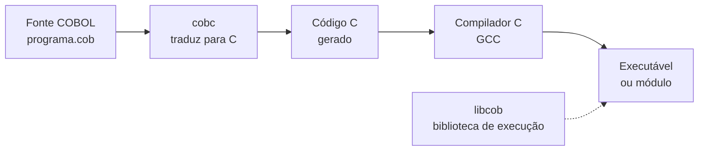

<h1 class="page-title">
  <svg class="title-icon" viewBox="0 0 24 24" fill="none" stroke="currentColor" stroke-width="1.8" stroke-linecap="round" stroke-linejoin="round" aria-hidden="true">
    <path d="M4 17l6-6-6-6"/>
    <path d="M12 19h8"/>
  </svg>
  GnuCOBOL
</h1>

> Instalação, compilação, execução e desenvolvimento de programas COBOL em ambientes modernos. Seu laboratório para praticar desde o início.

---

## Objetivos

Ao final desta seção, você deverá ser capaz de:

- Explicar o que é o GnuCOBOL e como ele compila um programa.
- Instalar o compilador no seu sistema operacional e verificar a instalação.
- Compilar e executar programas com o comando `cobc`.
- Usar as principais opções de compilação, incluindo formato livre e depuração.
- Organizar um projeto com programas, módulos e copybooks.
- Identificar e corrigir os erros mais comuns de compilação e execução.

---

## O que é o GnuCOBOL

O **GnuCOBOL** (antigo OpenCOBOL) é um compilador COBOL livre, de código aberto, que roda em Windows, Linux e macOS. Ele permite estudar e desenvolver programas COBOL em um computador pessoal, sem precisar de acesso a um mainframe.

Ele implementa grande parte dos padrões COBOL-85, COBOL 2002 e COBOL 2014, além de extensões de outros fabricantes. Por isso é bastante usado para aprendizado, para prototipação e para executar programas COBOL fora do mainframe.

O GnuCOBOL **não é um compilador de mainframe**. Ele não executa JCL, CICS nem DB2 nativamente. Esses componentes são tratados nos capítulos de [Mainframe e JCL]({{ 'programacao/cobol/mainframe/index.html' | relative_url }}). Para os fundamentos da linguagem, no entanto, ele atende muito bem.

---

## Como funciona

O GnuCOBOL não gera código de máquina diretamente. O comando `cobc` traduz o código COBOL para **linguagem C** e entrega o resultado a um compilador C (como o GCC), que produz o executável final.



Consequências práticas:

- É preciso ter um **compilador C** disponível. Nas distribuições prontas para Windows e nos pacotes de Linux e macOS, ele costuma vir incluído ou como dependência.
- O programa gerado depende da biblioteca de execução **libcob**, que implementa comandos como `DISPLAY`, `ACCEPT` e o acesso a arquivos.

---

## Instalação

### Linux

Na maioria das distribuições, o GnuCOBOL está nos repositórios oficiais:

```bash
# Debian, Ubuntu e derivados
sudo apt update
sudo apt install gnucobol

# Fedora
sudo dnf install gnucobol
```

### macOS

Com o gerenciador [Homebrew](https://brew.sh):

```bash
brew install gnucobol
```

### Windows

Há duas opções:

1. **WSL (recomendado):** instale o Subsistema Windows para Linux com `wsl --install`, abra a distribuição (por exemplo, Ubuntu) e siga os passos de Linux acima. O ambiente fica igual ao de Linux, o que facilita seguir os exemplos desta documentação.
2. **Binários prontos:** baixe uma distribuição compilada para Windows a partir da página oficial do projeto e use o prompt de comando que ela disponibiliza, já configurado com o compilador C e as variáveis de ambiente.

### Verificando a instalação

```bash
cobc --version
```

A saída mostra a versão do `cobc`, a versão do compilador C usado e a data de compilação. Prefira a série **3.x** (3.2 ou superior). Versões mais antigas, comuns em repositórios desatualizados, funcionam para o básico, mas podem não aceitar alguns recursos.

> **Dica:** a página oficial do projeto, <https://gnucobol.sourceforge.io>, traz os downloads mais recentes e a documentação completa.

---

## Primeiro programa

Crie um arquivo chamado `ola.cob` com o conteúdo abaixo. Lembre-se de que, no formato fixo, o código começa na **coluna 8**.

```cobol
       IDENTIFICATION DIVISION.
       PROGRAM-ID. OLAMUNDO.

       PROCEDURE DIVISION.
       PRINCIPAL.
           DISPLAY "Ola, GnuCOBOL!".
           STOP RUN.
```

Compile e execute:

```bash
cobc -x ola.cob
./ola
```

Saída:

```text
Ola, GnuCOBOL!
```

O que cada parte faz:

1. `cobc` é o compilador do GnuCOBOL.
2. `-x` indica que o resultado deve ser um **programa executável**.
3. Sem `-o`, o executável recebe o nome do arquivo-fonte (`ola`, ou `ola.exe` no Windows).
4. `./ola` executa o programa. O `./` é necessário no Linux e no macOS para rodar um arquivo da pasta atual.

---

## O comando cobc

A forma geral do comando é:

```bash
cobc [opções] arquivo-fonte [arquivo-fonte ...]
```

### Opções mais usadas

| Opção | Função |
|---|---|
| `-x` | Gera um programa **executável** |
| `-m` | Gera um **módulo** carregável (biblioteca `.so` ou `.dll`), usado por `CALL` dinâmico |
| `-o nome` | Define o nome do arquivo de saída |
| `-free` | Interpreta o fonte em **formato livre** |
| `-fixed` | Interpreta o fonte em **formato fixo** (padrão) |
| `-std=padrão` | Seleciona um dialeto, como `cobol85`, `cobol2014`, `ibm` ou `mf` |
| `-Wall` | Ativa a maioria dos avisos (*warnings*) |
| `-g` | Inclui informações para depuração com ferramentas como o `gdb` |
| `-debug` | Ativa verificações em tempo de execução (limites de tabelas, por exemplo) |
| `-I diretório` | Indica onde procurar **copybooks** (`COPY`) |
| `-c` | Compila sem gerar o executável (apenas objeto) |
| `-j` | Executa o programa logo após compilar |
| `-O`, `-O2` | Ativa otimizações |
| `--help` | Lista todas as opções disponíveis |

### Exemplos

```bash
# Executável com nome definido
cobc -x -o folha folha.cob

# Compilar e executar em um só comando
cobc -x -j ola.cob

# Compilar com avisos e verificações em tempo de execução
cobc -x -Wall -debug -g folha.cob

# Programa com dois fontes, ligados em um único executável
cobc -x principal.cob calculo.cob
```

> **Dica:** durante o estudo, compile sempre com `-Wall`. Os avisos ajudam a encontrar variáveis não usadas, truncamentos e outros problemas antes de virarem erros.

---

## Executando um programa

Um programa gerado com `-x` é executado diretamente pelo sistema:

```bash
./ola
```

Para ler dados do teclado, o programa usa `ACCEPT`. Exemplo (`soma.cob`):

```cobol
       IDENTIFICATION DIVISION.
       PROGRAM-ID. SOMA.

       DATA DIVISION.
       WORKING-STORAGE SECTION.
       01 WS-A       PIC 9(4) VALUE ZEROS.
       01 WS-B       PIC 9(4) VALUE ZEROS.
       01 WS-TOTAL   PIC 9(5) VALUE ZEROS.

       PROCEDURE DIVISION.
       PRINCIPAL.
           DISPLAY "Primeiro numero: " WITH NO ADVANCING.
           ACCEPT WS-A.
           DISPLAY "Segundo numero: " WITH NO ADVANCING.
           ACCEPT WS-B.
           ADD WS-A TO WS-B GIVING WS-TOTAL.
           DISPLAY "Total: " WS-TOTAL.
           STOP RUN.
```

```bash
cobc -x soma.cob
./soma
```

Exemplo de execução:

```text
Primeiro numero: 10
Segundo numero: 20
Total: 00030
```

Os zeros à esquerda aparecem porque o campo é `PIC 9(5)`. A formatação de números para exibição será vista em [Estruturas de Dados]({{ 'programacao/cobol/estruturas-dados/index.html' | relative_url }}).

---

## Formato fixo e formato livre

Por padrão, o `cobc` espera o **formato fixo**, com as áreas e colunas descritas em [Fundamentos]({{ 'programacao/cobol/fundamentos/index.html' | relative_url }}). Para escrever sem se preocupar com colunas, use o **formato livre**.

Arquivo `livre.cob`:

```cobol
IDENTIFICATION DIVISION.
PROGRAM-ID. LIVRE.
PROCEDURE DIVISION.
    DISPLAY "Formato livre".
    STOP RUN.
```

Compilação:

```bash
cobc -x -free livre.cob
```

Também é possível declarar o formato dentro do próprio arquivo, na primeira linha:

```cobol
>>SOURCE FORMAT IS FREE
```

Neste material, os exemplos usam formato fixo para manter a equivalência com o código de mainframe.

---

## Módulos e subprogramas

Um programa pode chamar outro por `CALL`. No GnuCOBOL, há duas formas de organizar isso.

**Subprograma** (`subprog.cob`):

```cobol
       IDENTIFICATION DIVISION.
       PROGRAM-ID. SUBPROG.

       PROCEDURE DIVISION.
       INICIO.
           DISPLAY "Executando o subprograma".
           GOBACK.
```

**Programa principal** (`mainprog.cob`):

```cobol
       IDENTIFICATION DIVISION.
       PROGRAM-ID. MAINPROG.

       PROCEDURE DIVISION.
       INICIO.
           CALL "SUBPROG".
           STOP RUN.
```

### Opção 1: ligar tudo em um único executável

```bash
cobc -x mainprog.cob subprog.cob -o app
./app
```

### Opção 2: módulo carregado em tempo de execução

```bash
cobc -m subprog.cob
cobc -x mainprog.cob
export COB_LIBRARY_PATH=.
./mainprog
```

O primeiro comando gera o módulo (`subprog.so` no Linux, `subprog.dll` no Windows). A variável `COB_LIBRARY_PATH` informa ao programa onde procurar os módulos. No Windows, use `set COB_LIBRARY_PATH=.` no prompt de comando.

Também é possível executar um módulo isolado com `cobcrun`:

```bash
cobcrun SUBPROG
```

A passagem de parâmetros, `LINKAGE SECTION` e `COPY` são detalhados no capítulo de [Modularização]({{ 'programacao/cobol/modularizacao/index.html' | relative_url }}).

---

## Variáveis de ambiente úteis

O comportamento do programa em execução pode ser ajustado por variáveis de ambiente, sem recompilar:

| Variável | Função |
|---|---|
| `COB_LIBRARY_PATH` | Pastas onde procurar módulos chamados por `CALL` |
| `COB_FILE_PATH` | Pasta usada como prefixo para arquivos abertos pelo programa |
| `COBCPY` | Pastas onde procurar copybooks durante a compilação |

Exemplo no Linux:

```bash
export COB_FILE_PATH=./dados
export COBCPY=./copy
```

O uso de arquivos externos é tratado em [Arquivos]({{ 'programacao/cobol/arquivos/index.html' | relative_url }}).

---

## Organização de um projeto

Uma estrutura simples e comum para estudo:

```text
meu-projeto/
├── src/        programas e subprogramas (.cob)
├── copy/       copybooks (.cpy)
├── dados/      arquivos de entrada e saída
├── bin/        executáveis e módulos gerados
└── Makefile    automatização da compilação
```

Convenções frequentes de extensão: `.cob` ou `.cbl` para programas e `.cpy` para copybooks.

### Automatizando com Makefile

```makefile
COBC  = cobc
FLAGS = -x -Wall -I copy

bin/folha: src/folha.cob
	$(COBC) $(FLAGS) -o $@ $<

clean:
	rm -f bin/*
```

Com isso, basta executar `make bin/folha` para compilar e `make clean` para limpar. O Makefile exige **tabulação** (e não espaços) antes dos comandos.

---

## Depuração e mensagens de erro

### Erros de compilação

O `cobc` informa o arquivo, a linha e a causa:

```text
folha.cob:12: error: syntax error, unexpected ...
```

Procure primeiro na linha indicada e na **linha anterior**. Um ponto final esquecido costuma provocar o erro na linha seguinte.

### Verificações em tempo de execução

Com `-debug`, o programa detecta problemas como acesso a posições inexistentes de uma tabela e interrompe a execução com uma mensagem da `libcob`, em vez de continuar com dados corrompidos:

```bash
cobc -x -debug tabela.cob
```

### Depuração com DISPLAY

A técnica mais simples e eficaz no começo é exibir o valor das variáveis em pontos estratégicos:

```cobol
           DISPLAY "DEBUG WS-TOTAL=" WS-TOTAL.
```

Linhas marcadas com `D` na coluna 7 só são compiladas quando a opção de depuração está ativa, o que permite deixar esses `DISPLAY` no código sem afetar a versão final:

```cobol
      D    DISPLAY "DEBUG WS-TOTAL=" WS-TOTAL.
```

---

## Editores e ferramentas

O GnuCOBOL não exige uma IDE: um editor de texto e o terminal bastam. Opções populares:

- **Visual Studio Code**, com uma extensão de COBOL para realce de sintaxe e régua de colunas.
- **Vim**, **Nano** ou qualquer editor de texto simples.
- **IDEs específicas** para GnuCOBOL, disponíveis em alguns ambientes.

> **Dica:** ative uma **régua de colunas** no editor e configure marcadores nas colunas 8, 12 e 72. Isso evita boa parte dos erros de formato fixo.

---

## Erros comuns

| Sintoma | Causa provável | Solução |
|---|---|---|
| `cobc: command not found` | GnuCOBOL não instalado ou fora do `PATH` | Reinstale ou ajuste o `PATH`; confira com `cobc --version` |
| `syntax error` logo após uma declaração | Ponto final esquecido na linha anterior | Revise os pontos finais |
| Erro em linha que parece correta | Código iniciado na coluna 1 a 6 ou além da coluna 72 | Confira as colunas ou compile com `-free` |
| `./programa: No such file` ou `command not found` ao executar | Executável chamado sem `./` ou em outra pasta | Use `./programa` na pasta correta |
| Módulo não encontrado ao usar `CALL` | `COB_LIBRARY_PATH` não definido ou módulo não compilado com `-m` | Compile o módulo e defina a variável |
| Arquivo não encontrado ao abrir | Caminho incorreto ou `COB_FILE_PATH` mal definido | Confira o caminho e o diretório de execução |
| Programa não encerra ou executa além do esperado | `STOP RUN` ou `GOBACK` ausente | Inclua o encerramento ao final da lógica |
| Comportamento diferente do esperado após atualizar | Mais de uma versão do `cobc` instalada | Verifique `which cobc` e `cobc --version` |

---

## Para praticar

1. Instale o GnuCOBOL e confirme com `cobc --version`.
2. Compile e execute o programa `ola.cob` deste capítulo.
3. Altere a mensagem, recompile e execute novamente.
4. Compile o programa `soma.cob` com `-Wall` e observe se há avisos.
5. Reescreva `ola.cob` em formato livre e compile com `-free`.
6. Gere um módulo com `-m` e chame-o a partir de outro programa.

Mais atividades estão na seção de [Exercícios]({{ 'programacao/cobol/exercicios/index.html' | relative_url }}).

---

## Resumo

- O GnuCOBOL é um compilador COBOL livre que traduz o código para C e usa um compilador C para gerar o executável.
- `cobc -x` gera um executável, `cobc -m` gera um módulo e `-o` define o nome da saída.
- `-free` ativa o formato livre; o padrão é o formato fixo, com código a partir da coluna 8.
- `-Wall`, `-g` e `-debug` ajudam a encontrar erros durante o estudo.
- Variáveis como `COB_LIBRARY_PATH`, `COB_FILE_PATH` e `COBCPY` controlam a busca por módulos, arquivos e copybooks.
- O GnuCOBOL é ideal para aprender a linguagem, mas não substitui JCL, CICS e DB2 de um mainframe.

---

## Próximos passos

<div class="wiki-topic-list">

  <a class="wiki-topic" href="{{ 'programacao/cobol/programacao/index.html' | relative_url }}">
    <span class="wiki-topic-title">Próximo: Programação</span>
    <span class="wiki-topic-description">Variáveis, operações, condições, loops e controle de fluxo.</span>
  </a>

  <a class="wiki-topic" href="{{ 'programacao/cobol/exercicios/index.html' | relative_url }}">
    <span class="wiki-topic-title">Exercícios</span>
    <span class="wiki-topic-description">Pratique compilação e execução com exercícios de nível iniciante.</span>
  </a>

  <a class="wiki-topic" href="{{ 'programacao/cobol/fundamentos/index.html' | relative_url }}">
    <span class="wiki-topic-title">Voltar para Fundamentos</span>
    <span class="wiki-topic-description">Revise divisões, formato do código e regras de sintaxe.</span>
  </a>

</div>