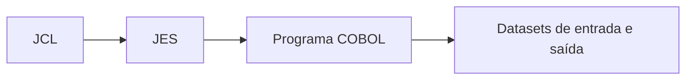

<h1 class="page-title">
  <svg class="title-icon" viewBox="0 0 24 24" fill="none" stroke="currentColor" stroke-width="1.8" stroke-linecap="round" stroke-linejoin="round" aria-hidden="true">
    <polygon points="6 3 20 12 6 21 6 3"/>
  </svg>
  JCL
</h1>

> Job Control Language: execução de programas, datasets, parâmetros e processamento em batch.

---

## Objetivos

Ao final desta seção, você deverá ser capaz de:

- Explicar o papel do JCL no processamento batch.
- Escrever os comandos `JOB`, `EXEC` e `DD`.
- Executar um programa COBOL e associar seus arquivos a datasets.
- Usar `PARM`, `COND`, `IF/THEN/ELSE` e procedures.
- Interpretar códigos de retorno e ABENDs.

---

## O que é JCL

**JCL** (*Job Control Language*) é a linguagem que diz ao z/OS **o que executar** e **com quais arquivos**. O programa COBOL contém a lógica; o JCL informa quais datasets físicos correspondem aos arquivos lógicos do programa.



---

## Estrutura de um job

Um job é composto por três tipos de comando:

| Comando | Função |
|---|---|
| `JOB` | Marca o início e identifica o job (um por job) |
| `EXEC` | Define um **passo** (*step*): programa ou procedure a executar |
| `DD` | *Data Definition*: descreve um dataset usado pelo passo |

```jcl
//MEUJOB   JOB (ACCT),'EXECUTA COBOL',CLASS=A,MSGCLASS=X,
//             NOTIFY=&SYSUID
//PASSO01  EXEC PGM=CLIENTES
//STEPLIB  DD DSN=USUARIO.COBOL.LOAD,DISP=SHR
//ENTRADA  DD DSN=USUARIO.CLIENTES.DADOS,DISP=SHR
//SAIDA    DD DSN=USUARIO.CLIENTES.RELAT,
//             DISP=(NEW,CATLG,DELETE),
//             SPACE=(TRK,(5,5),RLSE),
//             RECFM=FB,LRECL=80
//SYSOUT   DD SYSOUT=*
```

---

## Regras de sintaxe

- Cada linha tem **80 colunas** e começa com `//` nas colunas 1 e 2.
- Estrutura geral: `//NOME  OPERAÇÃO  PARÂMETROS`, separados por espaços.
- O **nome** começa na coluna 3, tem de 1 a 8 caracteres, e o primeiro não pode ser dígito.
- Parâmetros são separados por vírgula, **sem espaços** entre eles.
- Para continuar um comando, termine a linha com vírgula e comece a próxima com `//` seguido de espaços (a continuação começa até a coluna 16).
- `//*` na coluna 1 a 3 marca um **comentário**.
- `//` sozinho, em uma linha, marca o fim do job (opcional).
- Dados em linha: `DD *` seguido das linhas de dados e terminado por `/*`.

```jcl
//* ESTE E UM COMENTARIO
//ENTRADA  DD *
00001MARIA SILVA
00002JOAO SOUZA
/*
```

---

## JOB

```jcl
//MEUJOB   JOB (ACCT),'NOME',CLASS=A,MSGCLASS=X,MSGLEVEL=(1,1),
//             NOTIFY=&SYSUID,REGION=0M
```

| Parâmetro | Função |
|---|---|
| `(ACCT)` | Informação de contabilização |
| `'NOME'` | Texto identificador (nome do programador ou descrição) |
| `CLASS` | Classe de execução do job |
| `MSGCLASS` | Classe de saída das mensagens do sistema |
| `MSGLEVEL` | Quanto do JCL e das mensagens aparece na saída |
| `NOTIFY` | Usuário avisado quando o job termina |
| `REGION` | Memória máxima do job |

> Classes, contabilização e padrões variam entre instalações. Siga o modelo da sua empresa ou do ambiente em que você pratica.

---

## EXEC

Um passo executa **um programa** (`PGM=`) ou **uma procedure** (`PROC=` ou apenas o nome).

```jcl
//PASSO01  EXEC PGM=CLIENTES,PARM='2024,RELATORIO'
//PASSO02  EXEC PROC=SORTPROC
```

| Parâmetro | Função |
|---|---|
| `PGM` | Nome do módulo executável |
| `PARM` | Texto passado ao programa na execução |
| `COND` | Condição para **não** executar o passo (forma antiga) |
| `TIME` | Tempo máximo de CPU |
| `REGION` | Memória do passo |

### Recebendo PARM no COBOL

```cobol
       LINKAGE SECTION.
       01 LK-PARM.
          05 LK-PARM-TAM   PIC S9(04) COMP.
          05 LK-PARM-TXT   PIC X(100).

       PROCEDURE DIVISION USING LK-PARM.
           DISPLAY "PARAMETRO RECEBIDO: " LK-PARM-TXT(1:LK-PARM-TAM)
```

Os dois primeiros bytes têm o tamanho do texto, seguidos do texto em si.

---

## DD

O comando `DD` liga um **nome de DD** ao dataset físico. O nome de DD é o mesmo usado na cláusula `ASSIGN TO` do COBOL.

```cobol
           SELECT ARQ-ENTRADA ASSIGN TO ENTRADA.
```

```jcl
//ENTRADA  DD DSN=USUARIO.CLIENTES.DADOS,DISP=SHR
```

### Parâmetros principais

| Parâmetro | Função |
|---|---|
| `DSN` | Nome do dataset (`DSNAME`) |
| `DISP` | Estado do dataset e o que fazer ao final |
| `SPACE` | Espaço a alocar |
| `UNIT`, `VOL` | Dispositivo e volume (quando necessário) |
| `RECFM`, `LRECL`, `BLKSIZE` | Atributos do registro (`DCB`) |
| `SYSOUT` | Direciona a saída para o spool |
| `*` ou `DATA` | Dados em linha |

### DISP

Tem a forma `DISP=(situação,término normal,término anormal)`.

| Situação | Significado |
|---|---|
| `NEW` | Cria o dataset |
| `OLD` | Já existe, acesso exclusivo |
| `SHR` | Já existe, acesso compartilhado para leitura |
| `MOD` | Acrescenta ao final (ou cria, se não existir) |

| Disposição | Significado |
|---|---|
| `CATLG` | Cataloga o dataset |
| `UNCATLG` | Remove do catálogo e mantém o dataset |
| `KEEP` | Mantém o dataset |
| `DELETE` | Exclui o dataset |
| `PASS` | Passa para um passo seguinte do mesmo job |

Padrão mais comum para criar uma saída: `DISP=(NEW,CATLG,DELETE)`. Ou seja, cria; se o passo terminar bem, cataloga; se falhar, apaga.

### SPACE

```jcl
//SAIDA DD DSN=USUARIO.SAIDA,DISP=(NEW,CATLG,DELETE),
//         SPACE=(TRK,(10,5),RLSE),
//         RECFM=FB,LRECL=80
```

`SPACE=(TRK,(10,5),RLSE)` pede 10 trilhas, com extensão de 5 trilhas quando necessário, liberando o excesso ao final. A unidade também pode ser `CYL` (cilindros).

---

## DDs especiais

| DD | Uso |
|---|---|
| `STEPLIB` | Biblioteca onde está o módulo executável (`PGM=`) do passo |
| `JOBLIB` | Mesmo papel, mas válido para todos os passos do job |
| `SYSOUT` | Saída do programa, geralmente com `SYSOUT=*` |
| `SYSPRINT` | Saída de utilitários e compiladores |
| `SYSIN` | Entrada de controle, dados em linha |
| `SYSUDUMP`, `SYSABEND` | Dump em caso de ABEND |

---

## Datasets temporários

Um dataset cujo nome começa com `&&` é temporário e some ao final do job. Serve para passar dados entre passos.

```jcl
//PASSO01  EXEC PGM=GERADADO
//SAIDA    DD DSN=&&TEMP,DISP=(NEW,PASS),
//             SPACE=(TRK,(5,5)),RECFM=FB,LRECL=80
//PASSO02  EXEC PGM=USADADO
//ENTRADA  DD DSN=&&TEMP,DISP=(OLD,DELETE)
```

---

## Compilar e executar COBOL

Um job comum de compilação e execução tem, no mínimo, três etapas: compilar, link-editar e executar. Muitas instalações oferecem uma **procedure** pronta para isso, cujo nome varia de ambiente para ambiente.

```jcl
//COMPILA  JOB (ACCT),'COMPILA COBOL',CLASS=A,MSGCLASS=X
//PASSO1   EXEC PROC=COBPROC,PROGRAMA=CLIENTES
//COB.SYSIN DD DSN=USUARIO.COBOL.FONTE(CLIENTES),DISP=SHR
//LKED.SYSLMOD DD DSN=USUARIO.COBOL.LOAD(CLIENTES),DISP=SHR
```

> O nome da procedure (`COBPROC` aqui) e os parâmetros dela são **fictícios**. Consulte a procedure de compilação da sua instalação.

---

## Controle de fluxo entre passos

### COND

Define quando **pular** um passo, comparando com os códigos de retorno dos passos anteriores.

```jcl
//PASSO02  EXEC PGM=RELATORIO,COND=(4,LT)
```

`COND=(4,LT)` pula o passo se **4 for menor que** o código de retorno de qualquer passo anterior. A lógica de `COND` é considerada contraintuitiva, por indicar quando **não** executar.

### IF / THEN / ELSE

Forma mais legível, em que a condição indica quando **executar**.

```jcl
//TESTA    IF (PASSO01.RC = 0) THEN
//PASSO02    EXEC PGM=RELATORIO
//         ELSE
//PASSO03    EXEC PGM=AVISO
//         ENDIF
```

Também é possível testar `ABEND`, `NOT ABEND` e comparar com `<`, `>`, `<=`, `>=`, `=`, `NOT =`.

---

## Procedures

Uma **procedure** (PROC) é um trecho de JCL reutilizável, com parâmetros simbólicos.

```jcl
//MINHAPROC PROC PROG=,ENTRADA=
//PASSO1    EXEC PGM=&PROG
//ARQIN     DD DSN=&ENTRADA,DISP=SHR
//SYSOUT    DD SYSOUT=*
//          PEND
```

Chamando a procedure, informando os valores dos parâmetros:

```jcl
//PASSO01  EXEC MINHAPROC,PROG=CLIENTES,ENTRADA=USUARIO.CLIENTES.DADOS
```

Ao chamar, também é possível sobrescrever um DD da procedure: `//PASSO1.ARQIN DD DSN=OUTRO.DATASET,DISP=SHR`.

---

## Utilitários mais usados

| Utilitário | Função |
|---|---|
| `IEFBR14` | Programa vazio; serve para criar ou apagar datasets pelo `DISP` |
| `IEBGENER` | Copia um dataset sequencial para outro |
| `IEBCOPY` | Copia membros entre bibliotecas particionadas |
| `IDCAMS` | Gerencia VSAM e catálogo (`DEFINE`, `DELETE`, `REPRO`, `LISTCAT`) |
| `SORT` (DFSORT ou SYNCSORT) | Ordena, filtra e reformata dados |
| `IKJEFT01` | Executa comandos TSO em batch, usado em programas DB2 |

### Copiando um arquivo com IEBGENER

```jcl
//COPIA    EXEC PGM=IEBGENER
//SYSPRINT DD SYSOUT=*
//SYSUT1   DD DSN=USUARIO.ORIGEM,DISP=SHR
//SYSUT2   DD DSN=USUARIO.DESTINO,DISP=(NEW,CATLG,DELETE),
//             SPACE=(TRK,(5,5)),RECFM=FB,LRECL=80
//SYSIN    DD DUMMY
```

### Ordenando com SORT

```jcl
//ORDENA   EXEC PGM=SORT
//SYSOUT   DD SYSOUT=*
//SORTIN   DD DSN=USUARIO.CLIENTES.DADOS,DISP=SHR
//SORTOUT  DD DSN=USUARIO.CLIENTES.ORD,DISP=(NEW,CATLG,DELETE),
//             SPACE=(TRK,(5,5)),RECFM=FB,LRECL=80
//SYSIN    DD *
  SORT FIELDS=(6,30,CH,A)
/*
```

`SORT FIELDS=(6,30,CH,A)` ordena pelos 30 bytes que começam na posição 6, como caracteres (`CH`), em ordem crescente (`A`).

---

## Apagando um dataset com IEFBR14

```jcl
//APAGA    EXEC PGM=IEFBR14
//DD1      DD DSN=USUARIO.TESTE.ANTIGO,
//             DISP=(MOD,DELETE,DELETE),
//             SPACE=(TRK,(1,1))
```

---

## Erros e ABENDs comuns

| Código | Causa frequente |
|---|---|
| `JCL ERROR` | Erro de sintaxe; a mensagem em `JESMSGLG` indica a linha |
| `IEF212I` (DD NOT FOUND) | O DD usado pelo programa não existe no JCL |
| `IEC030I`, `SB37`, `SD37` | Espaço insuficiente no dataset |
| `S806` | Módulo de carga não encontrado (confira `STEPLIB` ou `JOBLIB`) |
| `S0C7` | Dado inválido em campo numérico (dados com `COMP-3` ou `PIC 9` corrompidos) |
| `S0C4` | Acesso a memória inválida (por exemplo, índice fora da tabela) |
| `S222` | Job cancelado pelo operador ou pelo usuário |
| `S322` | Tempo de CPU excedido |

Para depurar, comece pela saída do job no SDSF, lendo `JESMSGLG`, `JESJCL` e `SYSOUT`.

---

## Boas práticas

- Dar nomes significativos a jobs, passos e DDs.
- Usar `DISP=(NEW,CATLG,DELETE)` ao criar saídas, evitando datasets incompletos após falha.
- Usar `SHR` para entradas, evitando bloquear outros usuários.
- Testar o código de retorno entre passos críticos.
- Colocar parâmetros que mudam em variáveis simbólicas (`SET`) ou procedures.

```jcl
//         SET DATA=20240131
//PASSO01  EXEC PGM=CLIENTES,PARM='&DATA'
```

---

## Erros comuns de iniciantes

- Nome de DD no JCL diferente do usado no `ASSIGN TO` do COBOL.
- Espaço entre os parâmetros, quebrando a sintaxe.
- Esquecer o `STEPLIB` e receber `S806`.
- Criar um dataset que já existe (`NEW` em dataset catalogado).
- Escrever além da coluna 71 e perder parte do comando.

---

## Resumo

- O JCL descreve **o que** executar (`EXEC`) e **com quais datasets** (`DD`), dentro de um job (`JOB`).
- O nome de DD no JCL deve coincidir com o nome informado em `ASSIGN TO` no COBOL.
- `DISP`, `SPACE` e os atributos de registro controlam a criação e o destino dos datasets.
- `IF/THEN/ELSE` e `COND` controlam o fluxo entre passos, e procedures reaproveitam trechos de JCL.
- Os utilitários `IEFBR14`, `IEBGENER`, `IDCAMS` e `SORT` resolvem tarefas frequentes sem programar.
- Em caso de erro, a saída do job no SDSF traz as mensagens necessárias para o diagnóstico.

---

## Próximos passos

<div class="wiki-topic-list">

  <a class="wiki-topic" href="{{ 'programacao/cobol/cics.html' | relative_url }}">
    <span class="wiki-topic-title">Próximo: CICS</span>
    <span class="wiki-topic-description">Conheça o processamento transacional online.</span>
  </a>

  <a class="wiki-topic" href="{{ 'programacao/cobol/exercicios.html' | relative_url }}">
    <span class="wiki-topic-title">Exercícios</span>
    <span class="wiki-topic-description">Pratique o que viu nesta seção.</span>
  </a>

  <a class="wiki-topic" href="{{ 'programacao/cobol/index.html' | relative_url }}">
    <span class="wiki-topic-title">Voltar para COBOL</span>
    <span class="wiki-topic-description">Retorne à visão geral e à trilha de estudo.</span>
  </a>

</div>