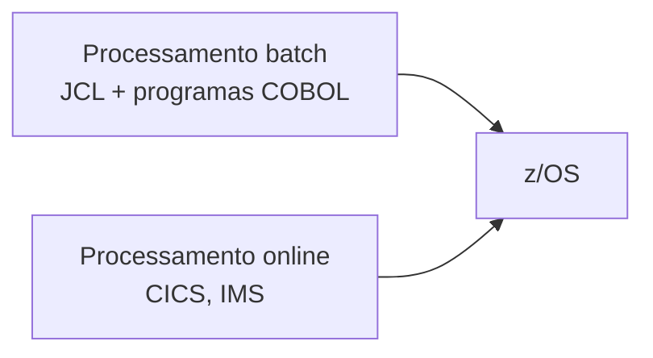

<h1 class="page-title">
  <svg class="title-icon" viewBox="0 0 24 24" fill="none" stroke="currentColor" stroke-width="1.8" stroke-linecap="round" stroke-linejoin="round" aria-hidden="true">
    <rect x="4" y="3" width="16" height="18" rx="2"/>
    <path d="M8 7h8M8 11h8"/>
    <circle cx="9" cy="16" r="1"/>
    <path d="M13 16h3"/>
  </svg>
  Mainframe
</h1>

> Conceitos de mainframe, z/OS, TSO, ISPF, datasets, jobs e SDSF.

---

## Objetivos

Ao final desta seção, você deverá ser capaz de:

- Explicar o que é um mainframe e por que ele ainda é usado.
- Reconhecer os principais componentes do z/OS.
- Navegar no TSO/ISPF e entender o que são datasets e membros.
- Diferenciar processamento batch e online.
- Acompanhar a execução de um job no SDSF.

---

## O que é um mainframe

**Mainframe** é um computador de grande porte, projetado para processar enormes volumes de transações com alta disponibilidade, segurança e confiabilidade. Os equipamentos atuais da IBM pertencem à família **IBM Z**, e o sistema operacional principal é o **z/OS**.

Características principais:

- **Alta disponibilidade:** projetado para operar continuamente, com componentes redundantes.
- **Grande capacidade de E/S:** atende milhares de transações por segundo.
- **Segurança:** controle de acesso centralizado, com produtos como RACF.
- **Compatibilidade:** programas antigos continuam rodando em equipamentos novos.
- **Uso compartilhado:** muitos usuários e cargas de trabalho no mesmo equipamento, isoladas entre si.

---

## z/OS

O **z/OS** é o sistema operacional de 64 bits da IBM para mainframes. Algumas de suas partes mais importantes:

| Componente | Função |
|---|---|
| **JES** (*Job Entry Subsystem*) | Recebe os jobs, controla a fila e gerencia a saída |
| **TSO/ISPF** | Interface interativa para o usuário |
| **SDSF** | Consulta de jobs, filas e saídas |
| **RACF** | Segurança e controle de acesso |
| **DFSMS** | Gerenciamento de armazenamento e de datasets |
| **VTAM / TCP/IP** | Comunicação em rede |
| **CICS, IMS, DB2** | Subsistemas de transações e de dados (rodam sobre o z/OS) |

---

## Batch e online



| Modo | Característica | Exemplo |
|---|---|---|
| **Batch** | Sem interação do usuário; processa grandes lotes de dados, geralmente em horários programados | Fechamento mensal, folha de pagamento |
| **Online** | Interativo, com resposta em segundos | Consulta de saldo no caixa eletrônico |

Os programas COBOL servem aos dois: rodam em batch por meio de JCL e em ambiente online, por exemplo sob o CICS.

---

## TSO e ISPF

**TSO** (*Time Sharing Option*) é o ambiente em que o usuário se conecta ao z/OS de forma interativa. O **ISPF** (*Interactive System Productivity Facility*) é o conjunto de menus em tela cheia usado sobre o TSO para editar, navegar e submeter jobs.

### Opções frequentes do menu ISPF

| Opção | Nome | Uso |
|---|---|---|
| `1` | View | Visualizar um dataset ou membro |
| `2` | Edit | Editar um dataset ou membro |
| `3` | Utilities | Utilitários, como listar, copiar e excluir datasets (`3.2` e `3.4`) |
| `6` | Command | Executar comandos TSO |
| `S` | SDSF | Acompanhar jobs (quando disponível no menu) |

> **Dica:** a tela **3.4** (*Data Set List*) é uma das mais usadas: lista os datasets que começam com um prefixo e permite abri-los.

### Comandos úteis no editor

| Comando | Efeito |
|---|---|
| `SUB` ou `SUBMIT` | Submete o conteúdo editado como job |
| `SAVE` | Grava as alterações |
| `CANCEL` | Sai sem gravar |
| `FIND texto` | Procura um texto |
| `CHANGE a b ALL` | Troca `a` por `b` em todas as ocorrências |
| `COLS` | Mostra a régua de colunas |
| `I`, `D`, `C`, `M` na área de numeração | Inserir, apagar, copiar e mover linhas |

---

## Datasets

No mainframe, o equivalente a "arquivo" é o **dataset**. Os nomes têm até 44 caracteres, divididos em **qualificadores** de até 8 caracteres separados por ponto. O primeiro qualificador costuma identificar o usuário ou a aplicação.

```text
USUARIO.COBOL.FONTE
USUARIO.COBOL.COPYLIB
PROD.CLIENTES.MENSAL
```

### Tipos de dataset

| Tipo | Descrição |
|---|---|
| **Sequencial (PS)** | Registros em sequência, como um arquivo de texto |
| **Particionado (PDS / PDSE)** | Biblioteca de **membros**, em que cada membro é como um arquivo; usado para fontes, copybooks e JCL |
| **VSAM** | Organização com acesso por chave (KSDS), entre outras |
| **GDG** | *Generation Data Group*: conjunto de versões numeradas do mesmo dataset |

Um membro de PDS é indicado entre parênteses:

```text
USUARIO.COBOL.FONTE(CLIENTES)
```

### Atributos importantes

| Atributo | Significado |
|---|---|
| `RECFM` | Formato do registro: `F` (fixo), `FB` (fixo em bloco), `V` (variável), `VB` (variável em bloco) |
| `LRECL` | Tamanho lógico do registro |
| `BLKSIZE` | Tamanho do bloco físico |
| `DSORG` | Organização: `PS`, `PO` (particionado), `VSAM` |

Fontes COBOL costumam ficar em datasets com `RECFM=FB` e `LRECL=80`, correspondendo às 80 colunas do formato fixo.

---

## Jobs

Um **job** é uma unidade de trabalho submetida ao sistema, descrita em **JCL**. O ciclo de vida é:


Cada job recebe um nome (definido no cartão `JOB`) e um número, atribuído pelo JES, como `JOB01234`. O conjunto de nome e número identifica a execução.

---

## SDSF

O **SDSF** (*System Display and Search Facility*) mostra o estado dos jobs e permite ler a saída deles.

| Comando | Tela |
|---|---|
| `ST` | Status: jobs em execução e na fila |
| `DA` | Atividade ativa do sistema |
| `H` | Held output: saídas retidas |
| `I` | Fila de entrada |

Comandos de linha mais usados na tela `ST`:

| Letra | Ação |
|---|---|
| `S` | Abrir (*select*) a saída do job |
| `?` | Listar os DDs (conjuntos de saída) do job |
| `P` | Descartar (*purge*) o job |
| `C` | Cancelar um job em execução |

Dentro da saída, os DDs mais importantes são `JESMSGLG` e `JESJCL` (mensagens do sistema e JCL expandido) e `SYSOUT` ou `SYSPRINT` (saída do programa e do compilador). É lá que se descobre por que um job falhou.

### Código de retorno

| Condition code | Significado típico |
|---|---|
| `0000` | Execução sem problemas |
| `0004` | Avisos |
| `0008` | Erro |
| `0012` | Erro grave |
| `0016` | Erro severo |
| `ABEND` | Término anormal (por exemplo `S0C7`, dado numérico inválido; `S806`, módulo não encontrado) |

O condition code de um programa COBOL é o valor de `RETURN-CODE` ao final da execução.

---

## Ambiente de estudo

Para praticar sem acesso a um mainframe corporativo, existem alternativas:

- **Emuladores**, como o Hercules, executam sistemas IBM antigos, como o MVS 3.8j (gratuito).
- **Programas educacionais** da IBM e de comunidades oferecem acesso a z/OS reais com contas gratuitas, como o IBM Z Xplore.
- **GnuCOBOL** permite praticar a linguagem COBOL localmente. Veja a seção [GnuCOBOL]({{ 'programacao/cobol/gnucobol/index.html' | relative_url }}).

> Programas e requisitos de acesso mudam com o tempo. Confira as informações atuais no site de cada um antes de começar.

---

## Erros comuns de iniciantes

- Confundir **dataset sequencial** com **membro de PDS** ao informar o nome no JCL.
- Esquecer que os fontes têm 80 colunas e deixar texto nas colunas 73 a 80.
- Submeter um job e não consultar a saída no SDSF.
- Usar `RECFM` e `LRECL` diferentes entre o programa e o dataset.
- Editar um dataset em modo que impede a gravação por estar sendo usado por outro usuário.

---

## Resumo

- Mainframes são sistemas de grande porte, e o z/OS é o sistema operacional da IBM para eles.
- O trabalho é dividido em **batch** (JCL) e **online** (CICS, IMS).
- O usuário interage pelo **TSO/ISPF**, e os arquivos se chamam **datasets**, que podem ser sequenciais, particionados ou VSAM.
- O **JES** gerencia os jobs, e o **SDSF** permite acompanhar status e saídas.
- O condition code indica o resultado do job, e `0000` é sucesso.

---

## Próximos passos

<div class="wiki-topic-list">

  <a class="wiki-topic" href="{{ 'programacao/cobol/jcl/index.html' | relative_url }}">
    <span class="wiki-topic-title">Próximo: JCL</span>
    <span class="wiki-topic-description">Aprenda a descrever e executar jobs em batch.</span>
  </a>

  <a class="wiki-topic" href="{{ 'programacao/cobol/exercicios/index.html' | relative_url }}">
    <span class="wiki-topic-title">Exercícios</span>
    <span class="wiki-topic-description">Pratique o que viu nesta seção.</span>
  </a>

  <a class="wiki-topic" href="{{ 'programacao/cobol/index.html' | relative_url }}">
    <span class="wiki-topic-title">Voltar para COBOL</span>
    <span class="wiki-topic-description">Retorne à visão geral e à trilha de estudo.</span>
  </a>

</div>