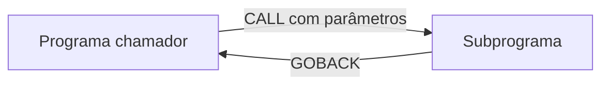

<h1 class="page-title">
  <svg class="title-icon" viewBox="0 0 24 24" fill="none" stroke="currentColor" stroke-width="1.8" stroke-linecap="round" stroke-linejoin="round" aria-hidden="true">
    <rect x="3" y="3" width="7" height="7" rx="1"/>
    <rect x="14" y="3" width="7" height="7" rx="1"/>
    <rect x="3" y="14" width="7" height="7" rx="1"/>
    <path d="M14 17.5h7M17.5 14v7"/>
  </svg>
  Modularização
</h1>

> Sections, parágrafos, subprogramas, CALL, passagem de parâmetros e COPYBOOKs.

---

## Objetivos

Ao final desta seção, você deverá ser capaz de:

- Dividir a `PROCEDURE DIVISION` em parágrafos e sections.
- Chamar subprogramas com `CALL` e receber parâmetros na `LINKAGE SECTION`.
- Diferenciar passagem por referência, por conteúdo e por valor.
- Reaproveitar layouts de dados com `COPY` e copybooks.

---

## Por que modularizar

Programas grandes em um único bloco de código são difíceis de ler, testar e manter. Dividir o código em partes com responsabilidade única reduz repetição e facilita a correção de erros.

| Nível | Recurso | Escopo |
|---|---|---|
| Dentro do programa | Parágrafos e sections | Mesmo programa, mesmos dados |
| Entre programas | Subprogramas com `CALL` | Programas separados, dados trocados por parâmetros |
| Entre arquivos-fonte | `COPY` (copybooks) | Reaproveitamento de texto, como layouts de registro |

---

## Parágrafos

Um **parágrafo** é um nome seguido de ponto, na Área A, que agrupa comandos. Ele é executado com `PERFORM`.

```cobol
       PROCEDURE DIVISION.
       PRINCIPAL.
           PERFORM INICIALIZA
           PERFORM PROCESSA
           PERFORM FINALIZA
           STOP RUN.

       INICIALIZA.
           DISPLAY "INICIO".

       PROCESSA.
           DISPLAY "PROCESSANDO".

       FINALIZA.
           DISPLAY "FIM".
```

> **Atenção:** o `STOP RUN` no fim do parágrafo principal é essencial. Sem ele, a execução continua nos parágrafos seguintes, em sequência.

### PERFORM THRU

`PERFORM A THRU B` executa do parágrafo `A` até o parágrafo `B`, incluindo todos os intermediários. Costuma-se usar um parágrafo de saída com `EXIT`:

```cobol
           PERFORM CALCULA THRU CALCULA-EXIT.

       CALCULA.
           ADD 1 TO WS-CONTADOR.
       CALCULA-EXIT.
           EXIT.
```

---

## Sections

Uma **section** agrupa parágrafos e termina onde começa a próxima section.

```cobol
       PROCEDURE DIVISION.
       ABERTURA SECTION.
       ABRE-ARQUIVOS.
           OPEN INPUT ARQ-ENTRADA.

       PROCESSAMENTO SECTION.
       LE-REGISTRO.
           READ ARQ-ENTRADA
               AT END MOVE "S" TO WS-FIM
           END-READ.
```

`PERFORM ABERTURA` executa a section inteira. Em código novo, é comum usar apenas parágrafos; as sections aparecem muito em código legado e em padrões de instalação.

---

## Subprogramas e CALL

Um **subprograma** é um programa COBOL independente, chamado por outro com `CALL`.



### Subprograma

```cobol
       IDENTIFICATION DIVISION.
       PROGRAM-ID. CALCIMP.

       DATA DIVISION.
       LINKAGE SECTION.
       01 LK-VALOR     PIC 9(07)V99.
       01 LK-IMPOSTO   PIC 9(07)V99.

       PROCEDURE DIVISION USING LK-VALOR LK-IMPOSTO.
       PRINCIPAL.
           COMPUTE LK-IMPOSTO = LK-VALOR * 0.10
           GOBACK.
```

### Programa chamador

```cobol
       IDENTIFICATION DIVISION.
       PROGRAM-ID. PRINCIPAL.

       DATA DIVISION.
       WORKING-STORAGE SECTION.
       01 WS-VALOR     PIC 9(07)V99 VALUE 1000.00.
       01 WS-IMPOSTO   PIC 9(07)V99 VALUE ZEROS.

       PROCEDURE DIVISION.
       INICIO.
           CALL "CALCIMP" USING WS-VALOR WS-IMPOSTO
           DISPLAY "IMPOSTO: " WS-IMPOSTO
           STOP RUN.
```

Pontos importantes:

- `PROCEDURE DIVISION USING` lista os parâmetros recebidos.
- A `LINKAGE SECTION` descreve os campos recebidos, sem alocar memória própria para eles.
- `GOBACK` devolve o controle ao chamador. `STOP RUN` encerraria toda a aplicação.
- Os parâmetros são posicionais: a ordem no `CALL` e no `USING` deve coincidir.

### Chamada estática e dinâmica

| Tipo | Forma | Característica |
|---|---|---|
| Estática | `CALL "NOME"` (literal) | O subprograma pode ser ligado ao executável na link-edição, conforme o ambiente |
| Dinâmica | `CALL WS-NOME-PROG` (variável) | O módulo é carregado em tempo de execução |

No GnuCOBOL, os subprogramas dinâmicos são compilados como módulos com `cobc -m`.

```bash
cobc -m calcimp.cob
cobc -x principal.cob
./principal
```

---

## Passagem de parâmetros

| Forma | Sintaxe | Efeito |
|---|---|---|
| Por referência (padrão) | `BY REFERENCE` | O subprograma recebe o endereço; alterações voltam ao chamador |
| Por conteúdo | `BY CONTENT` | Recebe uma cópia; alterações não voltam |
| Por valor | `BY VALUE` | Passa o valor em si, usado principalmente na integração com outras linguagens |

```cobol
           CALL "CALCIMP" USING BY CONTENT WS-VALOR
                                BY REFERENCE WS-IMPOSTO
```

### Código de retorno

O campo especial `RETURN-CODE` permite sinalizar sucesso ou erro ao chamador.

```cobol
      * NO SUBPROGRAMA
           MOVE 8 TO RETURN-CODE
           GOBACK.

      * NO CHAMADOR
           CALL "CALCIMP" USING WS-VALOR WS-IMPOSTO
           IF RETURN-CODE NOT = 0
               DISPLAY "ERRO NO SUBPROGRAMA"
           END-IF
```

### Tratando falha de CALL

```cobol
           CALL "MODULO-INEXISTENTE"
               ON EXCEPTION
                   DISPLAY "MODULO NAO ENCONTRADO"
           END-CALL
```

---

## COPYBOOKs

Um **copybook** é um arquivo de texto com trechos de código COBOL, normalmente layouts de registro, incluído nos programas com `COPY`. Assim, o layout é mantido em um único lugar.

### Arquivo CLIENTE.cpy

```cobol
       01 REG-CLIENTE.
          05 CLI-CODIGO   PIC 9(05).
          05 CLI-NOME     PIC X(30).
          05 CLI-SALDO    PIC 9(07)V99.
```

### Uso no programa

```cobol
       FD ARQ-CLIENTES.
           COPY CLIENTE.
```

### REPLACING

Permite adaptar o copybook ao incluí-lo, por exemplo para criar dois registros com prefixos diferentes:

```cobol
       COPY CLIENTE REPLACING ==CLI== BY ==ENT==.
```

> **Dica:** um copybook com o layout do registro, usado pelos programas que gravam e pelos que leem o arquivo, evita que cada programa tenha uma versão diferente da estrutura.

No GnuCOBOL, a pasta dos copybooks pode ser informada na compilação:

```bash
cobc -x -I copybooks programa.cob
```

---

## Boas práticas

- Dar a cada parágrafo uma única responsabilidade e um nome que descreva a ação (`LE-REGISTRO`, `GRAVA-SAIDA`).
- Manter um parágrafo principal curto, que apenas orquestra as chamadas.
- Usar `GOBACK` em subprogramas e `STOP RUN` apenas no programa principal.
- Documentar os parâmetros de cada subprograma, com tipo e tamanho.
- Manter layouts de arquivo e de tabela em copybooks.

---

## Erros comuns de iniciantes

- Esquecer o `STOP RUN` e deixar a execução "cair" nos parágrafos seguintes.
- Passar parâmetros em ordem ou com tamanho diferente do esperado pelo subprograma.
- Usar `STOP RUN` em subprograma, encerrando toda a aplicação.
- Não encontrar o módulo chamado dinamicamente (nome ou caminho incorreto).
- Alterar um copybook sem recompilar os programas que o utilizam.

---

## Resumo

- Parágrafos e sections organizam a lógica dentro de um mesmo programa, e `PERFORM` os executa.
- Subprogramas são programas separados chamados com `CALL ... USING`, e recebem os dados pela `LINKAGE SECTION`.
- Os parâmetros podem ser passados por referência, por conteúdo ou por valor.
- Copybooks, incluídos com `COPY`, reaproveitam layouts e declarações entre programas.

---

## Próximos passos

<div class="wiki-topic-list">

  <a class="wiki-topic" href="{{ 'programacao/cobol/bancos-dados/index.html' | relative_url }}">
    <span class="wiki-topic-title">Próximo: Bancos de Dados</span>
    <span class="wiki-topic-description">Integre COBOL com SQL e DB2.</span>
  </a>

  <a class="wiki-topic" href="{{ 'programacao/cobol/exercicios/index.html' | relative_url }}">
    <span class="wiki-topic-title">Exercícios</span>
    <span class="wiki-topic-description">Pratique o que viu nesta seção.</span>
  </a>

  <a class="wiki-topic" href="{{ 'programacao/cobol/index.html' | relative_url }}">
    <span class="wiki-topic-title">Voltar para COBOL</span>
    <span class="wiki-topic-description">Retorne à visão geral e à trilha de estudo.</span>
  </a>

</div>