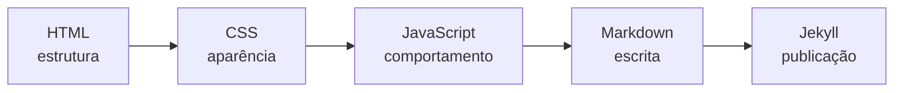

<h1 class="page-title">
  <svg class="title-icon" viewBox="0 0 24 24" fill="none" stroke="currentColor" stroke-width="1.8" stroke-linecap="round" stroke-linejoin="round" aria-hidden="true">
    <polyline points="16 18 22 12 16 6"/>
    <polyline points="8 6 2 12 8 18"/>
  </svg>
  Programação
</h1>

---

## Introdução

Programação reúne as linguagens e ferramentas usadas para criar páginas, scripts e documentação técnica.

Esta seção apresenta guias de estudo de **HTML**, **CSS** e **JavaScript**, que formam a base do desenvolvimento web, além de **Markdown** e **Jekyll**, usados para escrever e publicar esta wiki. Também há um guia de **COBOL**, linguagem ainda muito presente em sistemas corporativos.

O objetivo é aprender os fundamentos com exemplos práticos antes de avançar para projetos maiores.

---

## Conteúdo

Siga esta sequência para compreender como uma página web é construída, da estrutura ao comportamento, e como a documentação é escrita e publicada. O COBOL é independente e pode ser estudado a qualquer momento.

  <a class="wiki-topic" href="{{ 'programacao/html/index.html' | relative_url }}">
    HTML
    Estrutura de páginas: textos, links, tabelas, formulários e semântica.
  </a>

  <a class="wiki-topic" href="{{ 'programacao/css/index.html' | relative_url }}">
    CSS
    Estilos: seletores, box model, Flexbox, Grid e design responsivo.
  </a>

  <a class="wiki-topic" href="{{ 'programacao/javascript/index.html' | relative_url }}">
    JavaScript
    Dos fundamentos ao código assíncrono, com exemplos e exercícios.
  </a>

  <a class="wiki-topic" href="{{ 'programacao/markdown/index.html' | relative_url }}">
    Markdown
    Sintaxe e blocos de código para escrever documentação de forma padronizada.
  </a>

  <a class="wiki-topic" href="{{ 'programacao/jekyll/index.html' | relative_url }}">
    Jekyll
    Gerador de sites estáticos usado para publicar esta wiki no GitHub Pages.
  </a>

  <a class="wiki-topic" href="{{ 'programacao/cobol/index.html' | relative_url }}">
    COBOL
    Linguagem voltada ao processamento de dados, usada em sistemas bancários e corporativos.
  </a>

---

## Trilha de estudo

O fluxo recomendado para a parte web e de documentação é este:

Resumo dos tópicos:

| Tópico | Para que serve | Quando estudar |
| :--- | :--- | :--- |
| HTML | Define a estrutura e o conteúdo da página | Primeiro |
| CSS | Define cores, layout e responsividade | Depois do HTML |
| JavaScript | Adiciona interação e lógica | Depois do HTML e do CSS |
| Markdown | Escreve documentação de forma simples | A qualquer momento, e é pré-requisito do Jekyll |
| Jekyll | Transforma Markdown em um site publicado | Depois do Markdown |
| COBOL | Processamento de dados em sistemas corporativos | Independente da trilha web |

---

## Antes de começar

Você não precisa de muito para acompanhar os guias:

- Um **navegador** moderno (Firefox, Chrome ou Edge).
- Um **editor de texto ou de código**, como o VS Code.
- Opcionalmente, o **Git**, para versionar seus exercícios e publicar o site no GitHub Pages.

---

## Rotina de estudo recomendada

Para cada tópico, o aprendizado costuma render mais seguindo este fluxo:

1. **Ler** o guia de estudo.
2. **Testar** os exemplos.
3. **Fazer** os exercícios.
4. **Criar** um mini projeto.
5. **Revisar** o conteúdo depois de alguns dias.

---

## Boas práticas

- Digite os exemplos em vez de apenas copiá-los.
- Teste cada conceito em um arquivo seu antes de avançar.
- Use o DevTools do navegador (`F12`) para inspecionar e experimentar.
- Leia as mensagens de erro, especialmente as do console, pois elas costumam indicar a linha do problema.
- Faça pequenos projetos para fixar o que foi estudado.
- Versione seus estudos com Git, assim você pode experimentar sem medo de quebrar algo.
- Consulte a documentação oficial (como a MDN) sempre que tiver dúvidas.

---

## Em breve

Assuntos que podem entrar nesta seção:

- Python
- Bash
- Git para desenvolvedores
- APIs REST

---

> Esta seção reúne guias de estudo, referências e ferramentas de escrita técnica relacionados ao universo da programação.