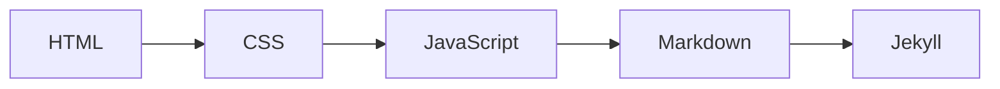

<h1 class="page-title">
  <svg class="title-icon" viewBox="0 0 24 24" fill="none" stroke="currentColor" stroke-width="1.8" stroke-linecap="round" stroke-linejoin="round" aria-hidden="true">
    <polyline points="16 18 22 12 16 6"/>
    <polyline points="8 6 2 12 8 18"/>
  </svg>
  Programação
</h1>

---

## Introdução

Programação reúne as linguagens e ferramentas usadas para criar páginas, scripts e documentação técnica.

Esta seção apresenta guias de estudo de HTML, CSS e JavaScript, que formam a base do desenvolvimento web, além de Markdown e Jekyll, usados para escrever e publicar esta wiki.

O objetivo é aprender os fundamentos com exemplos práticos antes de avançar para projetos maiores.

---

## Conteúdo

Siga esta sequência para compreender como uma página web é construída, da estrutura ao comportamento, e como a documentação é escrita e publicada.

<div class="wiki-topic-list">

  <a class="wiki-topic" href="{{ 'programacao/cobol/index.html' | relative_url }}">
    <span class="wiki-topic-title">COBOL</span>
    <span class="wiki-topic-description">Linguagem de programação.</span>
  </a>

  <a class="wiki-topic" href="{{ 'programacao/javascript/index.html' | relative_url }}">
    <span class="wiki-topic-title">JavaScript</span>
    <span class="wiki-topic-description">Dos fundamentos ao código assíncrono, com exemplos e exercícios.</span>
  </a>

  <a class="wiki-topic" href="{{ 'programacao/html/index.html' | relative_url }}">
    <span class="wiki-topic-title">HTML</span>
    <span class="wiki-topic-description">Estrutura de páginas: textos, links, tabelas, formulários e semântica.</span>
  </a>
  
  <a class="wiki-topic" href="{{ 'programacao/css/index.html' | relative_url }}">
    <span class="wiki-topic-title">CSS</span>
    <span class="wiki-topic-description">Estilos: seletores, box model, Flexbox, Grid e design responsivo.</span>
  </a>

  <a class="wiki-topic" href="{{ 'programacao/markdown/index.html' | relative_url }}">
    <span class="wiki-topic-title">Markdown</span>
    <span class="wiki-topic-description">Sintaxe e blocos de código para escrever documentação de forma padronizada.</span>
  </a>

  <a class="wiki-topic" href="{{ 'programacao/jekyll/index.html' | relative_url }}">
    <span class="wiki-topic-title">Jekyll</span>
    <span class="wiki-topic-description">Gerador de sites estáticos usado para publicar esta wiki no GitHub Pages.</span>
  </a>

</div>

---

O fluxo de estudo pode ser resumido assim:



---

## Rotina de estudo recomendada

Para cada tópico, o aprendizado costuma render mais seguindo este fluxo:

```text
Ler o guia de estudo
↓
Testar os exemplos
↓
Fazer os exercícios
↓
Criar um mini projeto
↓
Revisar o conteúdo
```

---

## Boas práticas

- Digite os exemplos em vez de apenas copiá-los.
- Teste cada conceito em um arquivo seu antes de avançar.
- Use o DevTools do navegador (`F12`) para inspecionar e experimentar.
- Faça pequenos projetos para fixar o que foi estudado.
- Consulte a documentação oficial (MDN) sempre que tiver dúvidas.

---

## Em breve

Assuntos que podem entrar nesta seção: Python, Bash, Git para desenvolvedores e APIs REST.

---

> Esta seção reúne guias de estudo, referências e ferramentas de escrita técnica relacionados ao universo da programação.