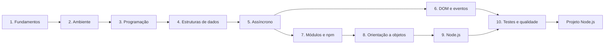

<h1 class="page-title">
  <svg class="title-icon" viewBox="0 0 24 24" fill="none" stroke="currentColor" stroke-width="1.8" stroke-linecap="round" stroke-linejoin="round" aria-hidden="true">
    <rect x="3" y="3" width="18" height="18" rx="2"/>
    <path d="M12 8v6a2 2 0 0 1-2 2"/>
    <path d="M16 16c.6.6 1.3 1 2 1 1 0 1.6-.5 1.6-1.3 0-.9-.7-1.2-1.6-1.6-.9-.4-1.5-.7-1.5-1.5 0-.7.6-1.1 1.4-1.1.6 0 1.1.2 1.5.6"/>
  </svg>
  JavaScript
</h1>

> A linguagem da web: dos fundamentos à programação assíncrona, do navegador ao Node.js, com um projeto prático para consolidar o que foi estudado.

---

## Sobre esta seção

JavaScript é a linguagem de programação da web. Ela roda em todos os navegadores e, com o **Node.js**, também fora deles, em servidores, ferramentas de linha de comando e automações. Por isso é uma das linguagens mais versáteis para quem está começando e para quem trabalha com desenvolvimento web.

Esta seção reúne o material de estudo em uma trilha progressiva. Você pode segui-la na ordem ou consultar cada tema de forma independente.

---

## Pré-requisitos

- Saber usar um editor de código, como o Visual Studio Code.
- Noções básicas de lógica de programação (variáveis, condições e repetições) ajudam, mas não são obrigatórias.
- Para a parte de navegador, conhecer o básico de HTML e CSS facilita.

---

## Trilha de estudo

---

## Conteúdo

Siga a sequência abaixo para estudar JavaScript dos fundamentos até o desenvolvimento com Node.js.

  <a class="wiki-topic" href="{{ 'programacao/javascript/fundamentos/index.html' | relative_url }}">
    1. Fundamentos
    História, ECMAScript, tipos de dados, variáveis com <code>let</code> e <code>const</code>, operadores e sintaxe básica.
  </a>

  <a class="wiki-topic" href="{{ 'programacao/javascript/ambiente/index.html' | relative_url }}">
    2. Ambiente
    Node.js, npm, console do navegador, DevTools e configuração do VS Code. Seu laboratório para praticar desde o início.
  </a>

  <a class="wiki-topic" href="{{ 'programacao/javascript/programacao/index.html' | relative_url }}">
    3. Programação
    Condições, laços, funções, arrow functions, escopo, closures e tratamento de erros.
  </a>

  <a class="wiki-topic" href="{{ 'programacao/javascript/estruturas-dados/index.html' | relative_url }}">
    4. Estruturas de Dados
    Arrays, objetos, <code>Map</code> e <code>Set</code>, desestruturação, spread e JSON.
  </a>

  <a class="wiki-topic" href="{{ 'programacao/javascript/assincrono/index.html' | relative_url }}">
    5. Programação Assíncrona
    Event loop, callbacks, Promises, <code>async</code>/<code>await</code> e requisições com <code>fetch</code>.
  </a>

  <a class="wiki-topic" href="{{ 'programacao/javascript/dom/index.html' | relative_url }}">
    6. DOM e Eventos
    Seleção e manipulação de elementos, eventos, formulários e armazenamento no navegador.
  </a>

  <a class="wiki-topic" href="{{ 'programacao/javascript/modulos/index.html' | relative_url }}">
    7. Módulos e npm
    Módulos ES e CommonJS, <code>package.json</code>, dependências e scripts.
  </a>

  <a class="wiki-topic" href="{{ 'programacao/javascript/orientacao-objetos/index.html' | relative_url }}">
    8. Orientação a Objetos
    Classes, herança, prototypes, <code>this</code> e padrões de organização de código.
  </a>

  <a class="wiki-topic" href="{{ 'programacao/javascript/nodejs/index.html' | relative_url }}">
    9. Node.js
    Sistema de arquivos, servidores HTTP, APIs REST e variáveis de ambiente.
  </a>

  <a class="wiki-topic" href="{{ 'programacao/javascript/testes/index.html' | relative_url }}">
    10. Testes e Qualidade
    Testes automatizados, depuração, ESLint e boas práticas.
  </a>

---

## Materiais de apoio

  <a class="wiki-topic" href="{{ 'programacao/javascript/guia-de-estudo.html' | relative_url }}">
    Guia de Estudo
    Roteiro organizado, metas por etapa e dicas para estudar JavaScript de forma consistente.
  </a>

  <a class="wiki-topic" href="{{ 'programacao/javascript/projeto-nodejs.html' | relative_url }}">
    Projeto Node.js
    Projeto prático para aplicar a trilha: construa uma aplicação completa passo a passo.
  </a>

  <a class="wiki-topic" href="{{ 'programacao/javascript/exercicios/index.html' | relative_url }}">
    Exercícios
    Exercícios progressivos para praticar sintaxe, lógica, assincronismo e manipulação do DOM. Podem ser feitos em paralelo a cada etapa.
  </a>

---

## Como estudar

1. **Pratique desde o primeiro dia.** Abra o console do navegador ou o Node.js e teste cada exemplo.
2. **Digite o código**, em vez de apenas copiar. Isso fixa a sintaxe.
3. **Erre e leia as mensagens de erro.** Elas indicam o arquivo, a linha e a causa.
4. **Faça os exercícios** de cada etapa antes de avançar.
5. **Construa algo seu.** Um projeto pequeno ensina mais que muitos exemplos isolados.
6. **Consulte a documentação oficial**, como a MDN Web Docs, para aprofundar.

---

## Ferramentas recomendadas

| Ferramenta | Uso |
|---|---|
| **Visual Studio Code** | Editor de código |
| **Node.js (versão LTS)** | Execução de JavaScript fora do navegador e gerenciador `npm` |
| **Navegador com DevTools** | Console, depuração e inspeção de páginas |
| **Git e GitHub** | Controle de versão e publicação dos projetos |

---

## Referências

- [MDN Web Docs: JavaScript](https://developer.mozilla.org/pt-BR/docs/Web/JavaScript)
- [Node.js: documentação](https://nodejs.org/docs/latest/api/)
- [ECMAScript: especificação da linguagem](https://tc39.es/ecma262/)