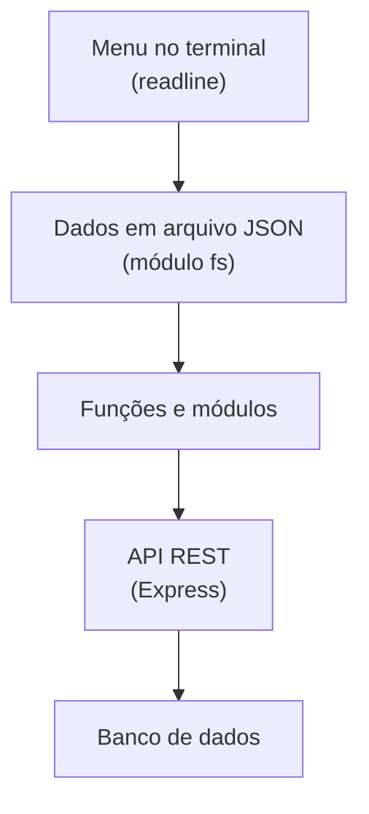

# JavaScript: primeiro projeto com Node.js

Este tutorial apresenta os primeiros conceitos de JavaScript usando **Node.js** no Windows.

A ideia é aprender JavaScript na prática, começando com um programa simples e evoluindo para um pequeno projeto de gerenciamento de servidores.

> **Como usar este tutorial:** digite os exemplos em vez de apenas copiá-los, execute cada um e só avance quando entender o resultado. Os exercícios no final ajudam a fixar o conteúdo.

## Sumário

1. [Pré-requisitos](#1-pré-requisitos)
2. [Criar a pasta do projeto](#2-criar-a-pasta-do-projeto)
3. [Criar o primeiro arquivo JavaScript](#3-criar-o-primeiro-arquivo-javascript)
4. [Variáveis e tipos de dados](#4-variáveis-e-tipos-de-dados)
5. [Operações matemáticas](#5-operações-matemáticas)
6. [Condições](#6-condições)
7. [Arrays](#7-arrays)
8. [Percorrendo uma lista](#8-percorrendo-uma-lista)
9. [Objetos](#9-objetos)
10. [Funções](#10-funções)
11. [Template strings](#11-template-strings)
12. [Primeiro programa usando vários conceitos](#12-primeiro-programa-usando-vários-conceitos)
13. [Inicializar um projeto com npm](#13-inicializar-um-projeto-com-npm)
14. [Criar o comando npm start](#14-criar-o-comando-npm-start)
15. [Receber entrada do usuário](#15-receber-entrada-do-usuário)
16. [Erros comuns](#16-erros-comuns)
17. [Próximo projeto: Gerenciador de Servidores](#17-próximo-projeto-gerenciador-de-servidores)
18. [O que estudar depois](#18-o-que-estudar-depois)
19. [Exercícios](#19-exercícios)

---

## 1. Pré-requisitos

Você vai precisar de:

- **Node.js** (versão LTS) e **npm**, que já vem junto com o Node.js.
- Um **editor de código**, como o VS Code.
- O **PowerShell**, que já vem no Windows.

Verifique se o Node.js e o npm estão instalados.

No PowerShell:

```powershell
node --version
npm --version
```

Exemplo de resultado (os números podem variar):

```text
v24.x.x
11.x.x
```

Se o comando `node` não for reconhecido, instale o Node.js pelo [site oficial](https://nodejs.org/) ou pelo `winget`:

```powershell
winget install OpenJS.NodeJS.LTS
```

Depois, **feche e abra o PowerShell novamente** para que o `PATH` seja atualizado.

### 1.1 Erro de política de execução do PowerShell

Se o `npm` apresentar uma mensagem informando que a execução de scripts está desabilitada, a política do PowerShell pode ser ajustada somente para o usuário atual:

```powershell
Set-ExecutionPolicy -Scope CurrentUser -ExecutionPolicy RemoteSigned
```

Depois, abra um novo PowerShell e teste novamente:

```powershell
npm --version
```

> **Alternativa:** sem alterar a política, é possível chamar o `npm.cmd` diretamente, por exemplo `npm.cmd --version`.

---

## 2. Criar a pasta do projeto

No PowerShell:

```powershell
cd $HOME
mkdir meu-primeiro-js
cd meu-primeiro-js
```

Confira o diretório atual:

```powershell
pwd
```

O resultado será semelhante a:

```text
Path
----
C:\Users\SeuUsuario\meu-primeiro-js
```

A estrutura inicial será:

```text
meu-primeiro-js/
```

---

## 3. Criar o primeiro arquivo JavaScript

Crie um arquivo chamado `app.js`. Pelo PowerShell:

```powershell
New-Item app.js -ItemType File
```

Abra a pasta no VS Code:

```powershell
code .
```

Coloque o seguinte conteúdo em `app.js`:

```javascript
console.log("Olá, mundo!");
```

Execute pelo PowerShell:

```powershell
node app.js
```

Resultado:

```text
Olá, mundo!
```

> **Importante:** o comando `node app.js` deve ser executado dentro da pasta onde o arquivo `app.js` existe.
>
> Se você estiver em `C:\Windows\System32`, por exemplo, o Node tentará encontrar:
>
> ```text
> C:\Windows\System32\app.js
> ```
>
> e apresentará `MODULE_NOT_FOUND` caso o arquivo não exista ali.

> **Dica:** digitar apenas `node` (sem arquivo) abre o modo interativo (REPL), útil para testar pequenos trechos. Para sair, use `.exit` ou `Ctrl + C` duas vezes.

---

## 4. Variáveis e tipos de dados

Variáveis permitem armazenar informações.

### 4.1 `const`

Use `const` quando o valor não será substituído:

```javascript
const nome = "João";
const idade = 35;

console.log("Nome:", nome);
console.log("Idade:", idade);
```

Resultado:

```text
Nome: João
Idade: 35
```

Tentar reatribuir uma `const` gera erro:

```javascript
const pais = "Brasil";
pais = "Argentina";
```

```text
TypeError: Assignment to constant variable.
```

### 4.2 `let`

Use `let` quando o valor poderá mudar:

```javascript
let idade = 35;

idade = 36;

console.log(idade);
```

Resultado:

```text
36
```

> **Regra prática:** comece sempre com `const` e use `let` apenas quando precisar mudar o valor. Evite `var`, que é a forma antiga e tem comportamentos confusos.

### 4.3 Tipos de dados

Os tipos mais comuns são:

| Tipo | Exemplo | Descrição |
| :--- | :--- | :--- |
| `string` | `"srv01"` | Texto |
| `number` | `35`, `3.14` | Números inteiros e decimais |
| `boolean` | `true`, `false` | Verdadeiro ou falso |
| `undefined` | `undefined` | Variável sem valor definido |
| `null` | `null` | Ausência intencional de valor |
| `object` | `{ nome: "João" }` | Objetos e arrays |

Para descobrir o tipo de um valor, use `typeof`:

```javascript
console.log(typeof "srv01");
console.log(typeof 35);
console.log(typeof true);
```

Resultado:

```text
string
number
boolean
```

---

## 5. Operações matemáticas

JavaScript também pode realizar cálculos:

```javascript
const salario = 6000;
const vale = 900;

const total = salario + vale;

console.log("Total:", total);
```

Resultado:

```text
Total: 6900
```

Principais operadores:

| Operador | Operação | Exemplo | Resultado |
| :---: | :--- | :--- | ---: |
| `+` | Soma | `10 + 3` | 13 |
| `-` | Subtração | `10 - 3` | 7 |
| `*` | Multiplicação | `10 * 3` | 30 |
| `/` | Divisão | `10 / 4` | 2.5 |
| `%` | Resto da divisão | `10 % 3` | 1 |
| `**` | Potência | `2 ** 3` | 8 |

Exemplo:

```javascript
const km = 270;
const litros = 10;

const consumo = km / litros;

console.log("Consumo:", consumo, "km/l");
```

Resultado:

```text
Consumo: 27 km/l
```

> **Cuidado:** o operador `+` também concatena textos. `"10" + 5` resulta em `"105"`, e não em `15`. Por isso é importante saber o tipo de cada valor.

---

## 6. Condições

Podemos fazer o programa tomar decisões usando `if` e `else`.

```javascript
const idade = 20;

if (idade >= 18) {
    console.log("Maior de idade");
} else {
    console.log("Menor de idade");
}
```

O JavaScript verifica a condição:

```text
idade >= 18
```

Se ela for verdadeira:

```text
Maior de idade
```

Caso contrário:

```text
Menor de idade
```

### 6.1 Operadores de comparação e lógicos

| Operador | Significado |
| :---: | :--- |
| `===` | Igual (valor e tipo) |
| `!==` | Diferente |
| `>` e `<` | Maior e menor |
| `>=` e `<=` | Maior ou igual e menor ou igual |
| `&&` | E (as duas condições verdadeiras) |
| `\|\|` | Ou (pelo menos uma verdadeira) |
| `!` | Negação |

> **Boa prática:** use sempre `===` em vez de `==`. O `==` converte tipos automaticamente e pode dar resultados inesperados.

### 6.2 `else if`

Para mais de duas possibilidades:

```javascript
const status = "offline";

if (status === "online") {
    console.log("Servidor ativo");
} else if (status === "manutencao") {
    console.log("Servidor em manutenção");
} else {
    console.log("Servidor indisponível");
}
```

Resultado:

```text
Servidor indisponível
```

---

## 7. Arrays

Um array é uma lista de valores.

```javascript
const frutas = [
    "Maçã",
    "Banana",
    "Laranja"
];

console.log(frutas);
```

Podemos acessar uma posição específica:

```javascript
console.log(frutas[0]);
```

Resultado:

```text
Maçã
```

### 7.1 Índices

JavaScript começa a contar os elementos a partir de `0`:

```text
0 → Maçã
1 → Banana
2 → Laranja
```

### 7.2 Adicionar elementos e contar

```javascript
frutas.push("Uva");

console.log(frutas.length);
console.log(frutas[3]);
```

Resultado:

```text
4
Uva
```

> Mesmo declarado com `const`, o array pode ter elementos adicionados. O `const` impede apenas que a variável `frutas` seja substituída por outro valor.

---

## 8. Percorrendo uma lista

Podemos utilizar `for...of` para percorrer os elementos de um array:

```javascript
const frutas = [
    "Maçã",
    "Banana",
    "Laranja"
];

for (const fruta of frutas) {
    console.log(fruta);
}
```

Resultado:

```text
Maçã
Banana
Laranja
```

Também existe o `for` clássico, útil quando você precisa do índice:

```javascript
for (let i = 0; i < frutas.length; i++) {
    console.log(i, frutas[i]);
}
```

Resultado:

```text
0 Maçã
1 Banana
2 Laranja
```

---

## 9. Objetos

Objetos são fundamentais em JavaScript.

Eles permitem agrupar informações relacionadas em pares de **chave** e **valor**.

Exemplo:

```javascript
const pessoa = {
    nome: "João",
    idade: 35,
    profissao: "Analista de Infraestrutura"
};

console.log(pessoa.nome);
console.log(pessoa.idade);
console.log(pessoa.profissao);
```

Resultado:

```text
João
35
Analista de Infraestrutura
```

Um objeto também pode representar um servidor:

```javascript
const servidor = {
    hostname: "srv01",
    ip: "10.0.0.10",
    sistema: "Linux",
    status: "online"
};

console.log(servidor.hostname);
console.log(servidor.ip);
console.log(servidor.status);
```

Propriedades podem ser alteradas ou adicionadas:

```javascript
servidor.status = "offline";
servidor.ambiente = "Produção";

console.log(servidor);
```

Esse conceito será bastante útil em projetos relacionados a infraestrutura.

---

## 10. Funções

Uma função é um bloco de código que pode ser reutilizado.

```javascript
function saudacao(nome) {
    console.log("Olá, " + nome);
}

saudacao("João");
saudacao("Maria");
```

Resultado:

```text
Olá, João
Olá, Maria
```

### 10.1 Funções que retornam valores

Uma função pode utilizar `return`:

```javascript
function somar(a, b) {
    return a + b;
}

const resultado = somar(10, 20);

console.log(resultado);
```

Resultado:

```text
30
```

### 10.2 Funções com objetos

Funções também recebem objetos como parâmetro:

```javascript
function descrever(servidor) {
    return servidor.hostname + " (" + servidor.ip + ") - " + servidor.status;
}

const srv = {
    hostname: "srv01",
    ip: "10.0.0.10",
    status: "online"
};

console.log(descrever(srv));
```

Resultado:

```text
srv01 (10.0.0.10) - online
```

> Existe também a sintaxe de **arrow function** (`const somar = (a, b) => a + b;`), muito comum em código moderno. Ela será estudada em um próximo guia.

---

## 11. Template strings

Template strings facilitam a criação de textos que possuem variáveis.

```javascript
const nome = "João";
const idade = 35;

console.log(`Meu nome é ${nome} e tenho ${idade} anos.`);
```

Resultado:

```text
Meu nome é João e tenho 35 anos.
```

Template strings utilizam **crases** (`` ` ``) em vez de aspas (`"`). Dentro delas, o trecho `${...}` insere o valor de uma variável ou expressão.

Elas também permitem textos com várias linhas:

```javascript
const relatorio = `Servidor: srv01
Status: online`;

console.log(relatorio);
```

Resultado:

```text
Servidor: srv01
Status: online
```

Agora a função da seção anterior fica mais legível:

```javascript
function descrever(servidor) {
    return `${servidor.hostname} (${servidor.ip}) - ${servidor.status}`;
}
```

---

## 12. Primeiro programa usando vários conceitos

Agora vamos juntar os conceitos aprendidos e criar uma lista de servidores.

Crie ou substitua o conteúdo de `app.js`:

```javascript
const servidores = [
    {
        hostname: "srv01",
        ip: "10.0.0.10",
        sistema: "Linux",
        status: "online"
    },
    {
        hostname: "srv02",
        ip: "10.0.0.11",
        sistema: "Linux",
        status: "offline"
    },
    {
        hostname: "srv03",
        ip: "10.0.0.12",
        sistema: "Windows",
        status: "online"
    }
];

for (const servidor of servidores) {
    console.log("-------------------------");
    console.log(`Hostname: ${servidor.hostname}`);
    console.log(`IP:       ${servidor.ip}`);
    console.log(`Sistema:  ${servidor.sistema}`);
    console.log(`Status:   ${servidor.status}`);
}
```

Execute:

```powershell
node app.js
```

Resultado:

```text
-------------------------
Hostname: srv01
IP:       10.0.0.10
Sistema:  Linux
Status:   online
-------------------------
Hostname: srv02
IP:       10.0.0.11
Sistema:  Linux
Status:   offline
-------------------------
Hostname: srv03
IP:       10.0.0.12
Sistema:  Windows
Status:   online
```

Neste exemplo já utilizamos:

- `const`
- arrays
- objetos
- `for...of`
- propriedades de objetos
- template strings

> **Dica:** para ver os mesmos dados em formato de tabela no terminal, experimente adicionar `console.table(servidores);` ao final do arquivo.

---

## 13. Inicializar um projeto com npm

O npm é o gerenciador de pacotes do Node.js.

Dentro da pasta do projeto:

```powershell
npm init -y
```

Será criado:

```text
meu-primeiro-js/
├── app.js
└── package.json
```

O arquivo `package.json` contém informações e configurações do projeto.

Para visualizar:

```powershell
Get-Content package.json
```

Um exemplo (o conteúdo exato pode variar conforme a versão do npm):

```json
{
  "name": "meu-primeiro-js",
  "version": "1.0.0",
  "description": "",
  "main": "app.js",
  "scripts": {
    "test": "echo \"Error: no test specified\" && exit 1"
  },
  "keywords": [],
  "author": "",
  "license": "ISC"
}
```

---

## 14. Criar o comando npm start

Podemos configurar o npm para executar o programa.

Abra o arquivo `package.json` e, dentro de `scripts`, adicione a linha `start`:

```json
"scripts": {
  "start": "node app.js",
  "test": "echo \"Error: no test specified\" && exit 1"
}
```

Atenção à **vírgula** entre os itens. O JSON não aceita vírgula depois do último item nem comentários.

O arquivo ficará semelhante a:

```json
{
  "name": "meu-primeiro-js",
  "version": "1.0.0",
  "description": "",
  "main": "app.js",
  "scripts": {
    "start": "node app.js",
    "test": "echo \"Error: no test specified\" && exit 1"
  },
  "keywords": [],
  "author": "",
  "license": "ISC"
}
```

Agora podemos executar o programa com:

```powershell
npm start
```

Em vez de:

```powershell
node app.js
```

---

## 15. Receber entrada do usuário

Até agora, todas as informações foram colocadas diretamente no código.

O Node.js possui módulos que permitem interagir com o terminal.

Vamos utilizar o módulo `readline`.

Crie um arquivo `entrada.js`:

```javascript
const readline = require("readline");

const rl = readline.createInterface({
    input: process.stdin,
    output: process.stdout
});

rl.question("Qual é o seu nome? ", (nome) => {
    console.log(`Olá, ${nome}!`);

    rl.close();
});
```

Execute:

```powershell
node entrada.js
```

O programa exibirá:

```text
Qual é o seu nome?
```

Digite `João` e pressione `Enter`:

```text
Olá, João!
```

Agora o programa está recebendo informações do usuário.

### 15.1 A entrada é sempre texto

Tudo o que o usuário digita chega como **string**. Para fazer cálculos ou comparações numéricas, converta com `Number()`:

```javascript
const readline = require("readline");

const rl = readline.createInterface({
    input: process.stdin,
    output: process.stdout
});

rl.question("Qual é a sua idade? ", (resposta) => {
    const idade = Number(resposta);

    if (idade >= 18) {
        console.log("Maior de idade");
    } else {
        console.log("Menor de idade");
    }

    rl.close();
});
```

> Os exemplos usam `require`, o formato de módulos **CommonJS**, que é o padrão quando o `package.json` não define outro tipo. Os módulos ES (`import`) serão vistos em um guia futuro.

---

## 16. Erros comuns

| Mensagem | Causa provável | Solução |
| :--- | :--- | :--- |
| `node` não é reconhecido | Node.js não instalado ou terminal aberto antes da instalação | Instalar o Node.js e abrir um novo PowerShell |
| Execução de scripts desabilitada (`npm.ps1`) | Política de execução do PowerShell | Seção 1.1 |
| `MODULE_NOT_FOUND` | Comando executado na pasta errada ou nome do arquivo incorreto | Use `pwd` e `Get-ChildItem` para conferir |
| `SyntaxError: Unexpected token` | Falta de vírgula, chave, parêntese ou aspas | Revise a linha indicada na mensagem |
| `ReferenceError: x is not defined` | Variável não declarada ou com nome digitado errado | Confira a declaração e a grafia |
| `TypeError: Assignment to constant variable.` | Reatribuição de uma `const` | Use `let` se o valor precisa mudar |
| `Missing script: "start"` | Script `start` não existe no `package.json` | Seção 14 |

> **Dica:** leia a mensagem de erro com calma. O Node.js informa o arquivo e a linha onde o problema ocorreu.

---

## 17. Próximo projeto: Gerenciador de Servidores

A partir dos conceitos apresentados neste tutorial, podemos começar a desenvolver um projeto mais completo.

Uma primeira versão pode ter um menu:

```text
================================
     GERENCIADOR DE SERVIDORES
================================

1 - Listar servidores
2 - Adicionar servidor
3 - Remover servidor
4 - Consultar servidor
5 - Sair

Escolha uma opção:
```

Cada servidor poderia ser representado por um objeto:

```javascript
{
    hostname: "srv-web01",
    ip: "10.0.10.10",
    sistema: "Rocky Linux",
    ambiente: "Produção",
    status: "online"
}
```

O projeto pode evoluir gradualmente:



> Use sempre dados fictícios nos exemplos e projetos de estudo. Evite colocar hostnames, IPs e credenciais reais de ambientes de produção em código ou repositórios públicos.

---

## 18. O que estudar depois

### 18.1 Já visto neste tutorial

- Variáveis (`const` e `let`)
- Operadores e condições (`if / else`)
- Arrays e `for...of`
- Objetos
- Funções
- Template strings
- `npm` básico e entrada de dados com `readline`

### 18.2 Próximos passos recomendados

1. Tipos de dados e conversões
2. `while` e `for`
3. Métodos de arrays (`map`, `filter`, `find`, `forEach`)
4. Arrow functions
5. JSON (`JSON.parse` e `JSON.stringify`)
6. Módulos (`require`, `import` e `export`)
7. Manipulação de arquivos com o módulo `fs`
8. Promises
9. `async/await`
10. Consumo de APIs com `fetch`
11. Criação de APIs com Express

O ideal é aprender cada assunto criando pequenos programas, em vez de apenas memorizar a sintaxe.

---

## 19. Exercícios

Tente resolver sozinho antes de abrir a solução.

### Exercício 1: Saudação

Crie um programa que tenha uma variável `nome` e mostre:

```text
Olá, João!
```

<details markdown="1">
<summary>Ver solução</summary>

```javascript
const nome = "João";

console.log(`Olá, ${nome}!`);
```

</details>

---

### Exercício 2: Calculadora

Crie duas variáveis:

```javascript
const numero1 = 10;
const numero2 = 5;
```

Mostre:

```text
Soma: 15
Subtração: 5
Multiplicação: 50
Divisão: 2
```

<details markdown="1">
<summary>Ver solução</summary>

```javascript
const numero1 = 10;
const numero2 = 5;

console.log("Soma:", numero1 + numero2);
console.log("Subtração:", numero1 - numero2);
console.log("Multiplicação:", numero1 * numero2);
console.log("Divisão:", numero1 / numero2);
```

</details>

---

### Exercício 3: Maioridade

Crie uma variável `idade` e informe se a pessoa é maior ou menor de idade.

<details markdown="1">
<summary>Ver solução</summary>

```javascript
const idade = 17;

if (idade >= 18) {
    console.log("Maior de idade");
} else {
    console.log("Menor de idade");
}
```

</details>

---

### Exercício 4: Lista

Crie um array contendo cinco nomes e percorra a lista utilizando `for...of`.

<details markdown="1">
<summary>Ver solução</summary>

```javascript
const nomes = ["Ana", "Bruno", "Carla", "Diego", "Elisa"];

for (const nome of nomes) {
    console.log(nome);
}
```

</details>

---

### Exercício 5: Servidores

Crie um array com pelo menos três servidores.

Cada servidor deve possuir:

- hostname
- IP
- sistema operacional
- status

Depois, percorra a lista e exiba os dados de cada servidor.

<details markdown="1">
<summary>Ver solução</summary>

```javascript
const servidores = [
    { hostname: "srv01", ip: "10.0.0.10", sistema: "Linux", status: "online" },
    { hostname: "srv02", ip: "10.0.0.11", sistema: "Linux", status: "offline" },
    { hostname: "srv03", ip: "10.0.0.12", sistema: "Windows", status: "online" }
];

for (const servidor of servidores) {
    console.log(`${servidor.hostname} | ${servidor.ip} | ${servidor.sistema} | ${servidor.status}`);
}
```

</details>

---

### Exercício 6: Contar servidores online

Usando o array do exercício anterior, conte quantos servidores estão com `status` igual a `"online"` e mostre:

```text
Servidores online: 2
```

> **Dica:** crie uma variável `let online = 0;` e some `1` dentro do `for...of` sempre que a condição for verdadeira.

<details markdown="1">
<summary>Ver solução</summary>

```javascript
let online = 0;

for (const servidor of servidores) {
    if (servidor.status === "online") {
        online++;
    }
}

console.log(`Servidores online: ${online}`);
```

</details>

---

## Checklist

Antes de avançar para o próximo guia, verifique se você consegue:

- [ ] Executar um arquivo com `node arquivo.js` na pasta correta.
- [ ] Explicar a diferença entre `const` e `let`.
- [ ] Usar `if`, `else if` e `else`.
- [ ] Criar e percorrer um array com `for...of`.
- [ ] Criar um objeto e acessar suas propriedades.
- [ ] Escrever uma função com parâmetros e `return`.
- [ ] Usar template strings com `${...}`.
- [ ] Criar um projeto com `npm init -y` e um script `start`.
- [ ] Ler uma entrada do usuário com `readline`.

---

## Conclusão

Neste primeiro tutorial você criou seu primeiro programa JavaScript usando Node.js e aprendeu os principais fundamentos necessários para começar.

O mais importante neste momento é **praticar**.

Em vez de tentar aprender toda a linguagem de uma vez, desenvolva pequenos programas e aumente a complexidade gradualmente.

O próximo passo natural é transformar o exemplo de servidores em um **Gerenciador de Servidores Linux em JavaScript**, adicionando menu, cadastro, consulta, remoção e armazenamento dos dados.